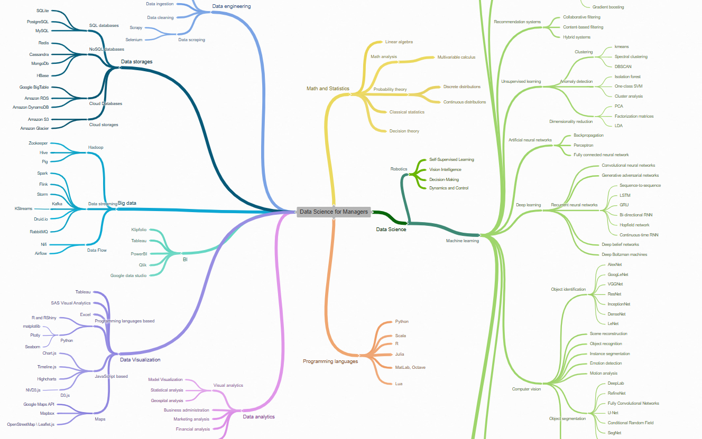

Die Vorlesung ist fast am Ende. Nutzen Sie diesen Zeitslot, um
* Ihre Analyse abzuschließen
* das Wissen der Veranstaltung zusammenzutragen und sich in Erinnerung zu rufen.

**Aufgabe:** Werfen Sie einen Blick auf die Inhalte der Vorlesung. Machen Sie sich klar, wo Sie Verständnisschwierigkeiten hatten und was Ihnen entfallen ist. Bringen Sie Fragen zur nächsten Veranstaltung mit.
{: .notice--warning} 

**Hinweis:** Das [Repository mit dem Code zur Vorlesung](https://github.com/chkra/ds-lecture) ist komplett öffentlich. Sie können nach Belieben auf den Markdown-Code zugreifen und sich eigene Wissensdokumente und Zusammenfassungen daraus zusammenstellen. Wenn Sie möchten, können Sie diese auch gern mit Ihren Kommilitonen teilen.
{: .notice--info} 

Als Rückblick: hier sind alle Links zu Inhalten der Vorlesung (leicht umsortiert):

| Kategorie | Thema | Inhalt | 
| :----- | :------------- |  :---------- |
| Grundlagen & Werkzeuge  | [Was ist Story Telling?](/modules/story-telling/story-telling.md) | Storytelling |
|  | [Was ist Data Science? (engl.)](/modules/01-defining-data-science/ds.md) |  Grundlegende Begriffe und Konzepte, Zusammenhang zu KI, ML, Big Data, IoT  | 
|  | [Ethik und Datenschutz (engl.)](/modules/02-ethics/ethics.md) |  Begriffe und Konzepte | 
|  | [Was sind Daten  (engl.)](/modules/03-defining-data/def_data.md) |  Definition und Arten von Daten  | 
|  | [Python](/modules/howto-python/python.md) |  Wie programmiert man in Python? | 
|  | [Anaconda](/modules/howto-anaconda/anaconda.md) |  Python installieren wie ein Profi | 
|  | [Jupyter](/modules/howto-anaconda/anaconda.md) |  Python installieren wie ein Profi | 
|  | [Git](/modules/howto-git/git.md) |  Wie bediene ich Git? | 
|  | [Konsole](/modules/howto-console/console.md) | Das wichtigste zum Umgang mit der Konsole | 
|  | [VMs](/modules/howto-vm/vm.md) |  Über die Pool-Rechner (on prem / remote) |  
| Daten als Projekt | [Python und Daten (engl.)](/modules/07-python/python.md) |  Einsatz von Python, um Daten zu laden und zu manipulieren| 
|  | [Deskriptive Statistik](/modules/descriptive-statistics/desc-stats.md) |  Statistische Eigenschaften von Daten | 
|  | [Qualität und Transformation (engl.)](/modules/08-data-preparation/data_prep.md) |  Transformation, Exploration und Qualitätsverbesserung von Daten | 
|  | [Typischer Projektablauf (engl.)](/modules/14-life-cycle-intro/lifecycle.md) |  Über die Struktur von Data Science Projekten | 
| Daten visualisieren | [Mengen visualisieren (engl.)](/modules/09-visualization-quantities/viz.md) |  Darstellung von Größen und Mengen | 
|  | [Verteilungen visualisieren (engl.)](/modules/10-visualization-distributions/viz_dist.md) |  Umgang mit statistischen Verteilungen | 
|  | [Verhältnisse visualisieren (engl.)](/modules/11-visualization-proportions/viz_prop.md) |  Denken in Proportionen und Größenordnungen | 
| Erweiterte Visualisierungen | [Beziehungen visualisieren](/modules/12-visualization-relationships/viz_rel.md) | Netzwerke und Abhängigkeiten | 
|  | [Zeitreihen visualisieren](/modules/time-series-data/timeseries.md) | Sequenzen und Zeitreihen visualisieren | 
|  | [Python: Time & DateTime](/modules/time-series-data/python-datetime.md/) | Detail-Übersicht zu Datum- und Zeitwerten in Python | 
|  | [Visualisierungen verstehen](/modules/13-meaningful-visualizations/viz_mean.md) | Hypothesen und Mehrwert erzeugen | 
|  | [Zeitreihen visualisieren](/modules/time-series-data/timeseries.md) | Sequenzen und Zeitreihen als besonderer Datentyp | 
| Strukturierte Daten | [Einfache Dateien](/modules/reading-structured-data/structured-data-files.md) | Persistierung strukturierter Daten auf Dateibasis | 
|  | [SQL in Python](/modules/reading-structured-data/structured-data-databases.md) | Datenanalyse mit SQL | 
|  | [Pandas](/modules/reading-structured-data/structured-data-pandas.md) | Pandas für Data Science | 
|  | [Excel](/modules/reading-structured-data/structured-data-exel.md) | Excel für Data Science | 
| Nichtstrukturierte Daten | [noSQL](/modules/noSQL/noSQL.md) | Data Engineering für nicht-relationale Daten | 
|  | [Bilddaten](/modules/cv-basics/cv-basics.md) | Laden und Verstehen von Bildern mit Python | 
|  | [Bilder klassifizieren](https://www.kaggle.com/code/iamleonie/pytorch-image-classification-tutorial-for-beginner) | Demo-Notebook zur Bildklassifikation | 
| Machine Learning | [Machine Learning Basics](/modules/ml-basics/ml-basics.md) | Grundlagen und Begriffe des Maschinellen Lernens | 
|  | [Clustering](/modules/clustering/clust.md) | Clustering als unüberwachtes Lernverfahren | 
|  | [Forecasting](/modules/forecasting/forecasting.md) | Einfache Vorhersage von Trends | 
|  | [Python: Time & DateTime](/modules/time-series-data/python-datetime.md) | Übersicht zu Datum- und Zeitwerten in Python | 
|  | [Supervised vs. Unsupervised](/modules/ml-basics/ml-basics.md) | Wiederholung: Arten von ML-Methoden |
|  | [Regression](/modules/regression/regression.md) | Lineare und logistische Regression |
|  | [Scikit PCA demo](https://scikit-learn.org/stable/auto_examples/decomposition/plot_pca_iris.html#sphx-glr-auto-examples-decomposition-plot-pca-iris-py) | Principal Component Analysis | 
|  | [Statistik](/modules/statistical-inference/stat-inf.md) | Verteilungen, Erwartungswerte und Hypothesentests | 
| ChatGPT | [Neuronale Netze (Grobe Intuition)](/modules/nn/nn.md) | Grundlagen zu Neuronalen Netzen, ganz einfach erklärt | 
|  | [Mathematik neuronaler Netze](https://towardsdatascience.com/simple-introduction-to-neural-networks-ac1d7c3d7a2c) | (externer Link) Gut gemachte detaillierte Erklärung der |  mathematischen Hintergründe zur Vertiefung| 
|  | [Autoencoder](/modules/autoencoder/autoencoder.md) | Neuronale Netze zur Komprimierung von Daten | 
|  | [RAG](/modules/rag/rag.md) | Retrieval Augmented Generation | 
|  | [Vektordatenbanken](/modules/vector-databases/vector-databases.md) | Vektordatenbanken zur effizienten Speicherung von Dokumenten | 
| DS im Unternehmen | [Business Intelligence](/modules/business-intelligence/bi.md) | Reporting und Business Intelligence | 
|  | [CRISP-DM](https://datasolut.com/crisp-dm-standard/) | Wiederholung: Data Science Projektmodelle (externer Link) |
|  | [KNIME](/modules/ds-plattform/ds-plattform.md) | Data Science Plattformen |
| Nachhaltigkeit | [Gender Shades](http://gendershades.org) | Beispiel: Relevanz von Datenqualität für Ethik | 
|  | [Bitkom Studie](https://www.bitkom.org/sites/default/files/2021-10/20211010_bitkom_studie_klimaeffekte_der_digitalisierung.pdf) | Digitalisierung für Nachhaltigkeit laut Bitkom |
|  | [DS und Nachhaltigkeit](/modules/sustainability/sustainability.md) | Noch mehr Beispiele für DS und Nachhaltigkeit | 
|  | [Grundsätze der DSGVO]("https://de.wikipedia.org/wiki/Datenschutz-Grundverordnung#Grunds%C3%A4tze_der_Verarbeitung_personenbezogener_Daten") | Sechs Grundsätze für die Verarbeitung personenbezogener Daten nach DSGVO |
|  | [BDSG](https://de.wikipedia.org/wiki/Bundesdatenschutzgesetz) | Rechte und Pflichten laut Bundesdatenschutzgesetz |
|  | [AI Regulation Act](https://en.wikipedia.org/wiki/Artificial_Intelligence_Act) | KI Regulierung, insb. Risikokategorien |

## 🛠 Im Workshop vor Ort

Im Workshop 
* schreiben wir eine Probeklausur
* erstellen wir gemeinsam eine Wissenslandkarte zu diesen Inhalten
* ist Zeit für alle Fragen, die Sie zu den Inhalten haben. 