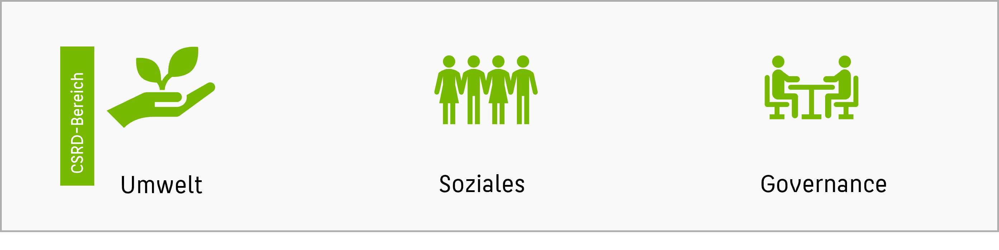
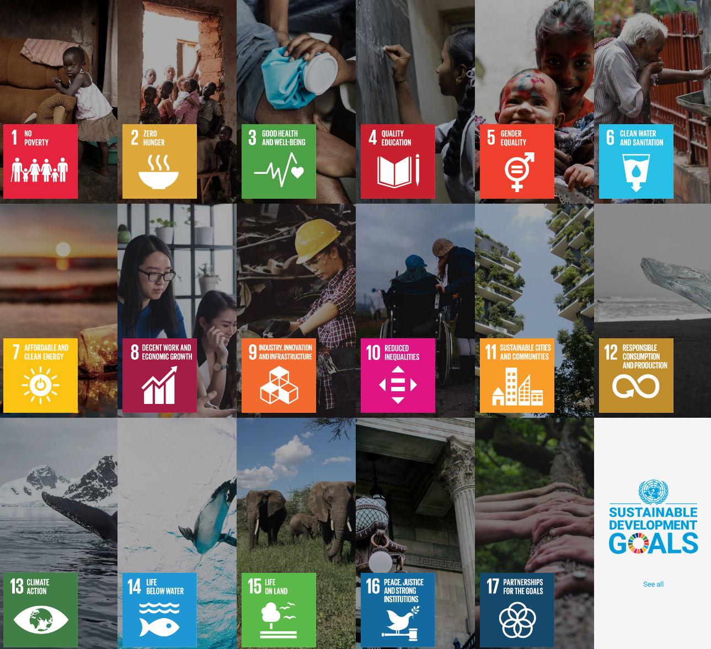

**Nachhaltigkeit** bezeichnet den nicht verschwenderischen, sparsamen, verantwortungsvollen Umgang mit nicht erneuerbaren Ressourcen und einen die jeweilige Regenerationsfähigkeit berücksichtigenden Umgang mit erneuerbaren bzw. nachwachsenden Ressourcen. Ziel ist langfristiges Denken und insb. langfristiges wirtschaftliches Handeln, das heute die Natur so nutzt, dass die Lebensgrundlagen zukünftiger Generationen dauerhaft erhalten bleiben (Generationenverantwortung).
{: .notice--info} 

Das heute insbesondere aus Unternehmenssicht gängigste Verständnis von Nachhaltigkeit ergibt sich aus der **Corporate Sustainability Reporting Directive** (CSRD), also den Vorgaben der EU zur Berichtserstattung zum Stand der Nachhaltigkeitsbemühungen im Unternehmen. Nach CSRD basiert die Nachhaltigkeit auf drei Säulen:
* Umweltaspekten (z.B. CO2-Fußabdruck, Wasserverbrauch, Umweltverschmutzung)
* Soziales (Umgang mit Minderheiten, Diskriminierung)
* Governance (Einhaltung der Gesetze z.B. zum Datenschutz)

Die Reporting-Direktive ist durchaus bürokratisch und anspruchsvoll. Die [European Financial Reporting Advisory Group](https://de.wikipedia.org/wiki/European_Financial_Reporting_Advisory_Group) (EFRAG) ist von der EU-Kommission beauftragt wurde, die konrketen Details in der Umsetzung auszuarbeiten. 

Eine globalere, ganzheitliche Definition des Konzeptes, die ebenfalls häufig verwendet wird, basiert auf den [*17 goals for sustainable development](https://sdgs.un.org/goals) der Vereinten Nationen. Diese Ziele fokussieren ganzheitlicher, unter anderem auf die Verminderungen von Hunger, Leid, Krieg und Ungleichheit in der Welt.

In dieser Veranstaltung wollen wir uns mit dem Zusammenhang zwischen Data Science und Nachhaltigkeit beschäftigen.

## Vorbereitung

**Aufgabe** Bitte studieren Sie die [Excel-Liste mit CSRD-Datenpunkten](https://efrag.sharefile.com/share/view/s6e410fb208aa4685bf9c482ee405f48d/foa75419-44c9-4081-85a5-43217a6e8732) und werfen Sie bei Interesse einen Blick auf die dazugehörigen [Erklärungen](https://www.efrag.org/Assets/Download?assetUrl=/sites/webpublishing/SiteAssets/EFRAG+IG+3+List+of+ESRS+Data+Points+-+Explanatory+Note.pdf) der EFRAG. 
{: .notice--warning} 

Überlegen Sie:
* Wo werden hier Data Scientists benötigt?
* Welche Dateninfrastruktur ist notwendig, um einen solchen Report zu erstellen?
* Nehmen Sie ein Ihnen gut vertrautes Unternehmen - was denken Sie, wie einfach diesem Unternehmen das Reporting gelingt?

**Aufgabe** Bitte machen Sie sich auch mit den folgenden Inhalten zur Nachhaltigkeit vertraut:
{: .notice--warning} 

| Thema | Inhalt | 
| :------------- |  :---------- |
| [Gender Shades](http://gendershades.org)(externer Link) | Beispiel: Relevanz von Datenqualität für Ethik | 
| [Bitkom Studie](https://www.bitkom.org/sites/default/files/2021-10/20211010_bitkom_studie_klimaeffekte_der_digitalisierung.pdf)(externer Link) | Digitalisierung für Nachhaltigkeit |
| [DS und Nachhaltigkeit](/modules/sustainability/sustainability.md) | Noch mehr Beispiele für DS und Nachhaltigkeit | 

**Aufgabe** Folgende Inhalte sollten Ihnen noch von einem früheren Zeitpunkt vertraut sein:
{: .notice--warning} 

| Thema | Inhalt | 
| :------------- |  :---------- |
| [Data Science und Ethik](/modules/02-ethics/ethics.md) | Data Science und Ethik |
| [Grundsätze der DSGVO]("https://de.wikipedia.org/wiki/Datenschutz-Grundverordnung#Grunds%C3%A4tze_der_Verarbeitung_personenbezogener_Daten") | Sechs Grundsätze für die Verarbeitung personenbezogener Daten nach DSGVO |
| [BDSG](https://de.wikipedia.org/wiki/Bundesdatenschutzgesetz) | Rechte und Pflichten laut Bundesdatenschutzgesetz |
| [AI Regulation Act](https://en.wikipedia.org/wiki/Artificial_Intelligence_Act) | KI Regulierung, insb. Risikokategorien |