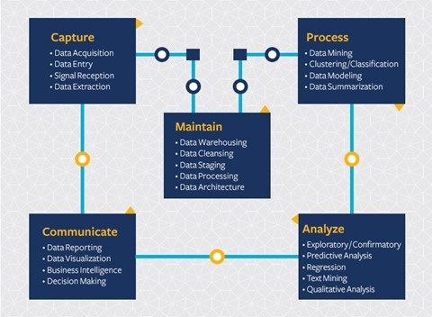

At this point you've probably come to the realization that data science is a process. This process can be broken down into 5 stages:

- Capturing
- Processing
- Analysis
- Communication
- Maintenance

This lesson focuses on 3 parts of the life cycle: capturing, processing and maintenance.

## Capturing Data

The first stage of the lifecycle is very important as the next stages are dependent on it. It’s practically two stages combined into one: acquiring the data and defining the purpose and problems that need to be addressed. 
Defining the goals of the project will require deeper context into the problem or question. First, we need to identify and acquire those who need their problem solved. These may be stakeholders in a business or sponsors of the project, who can help identify who or what will benefit from this project as well as what, and why they need it. A well-defined goal should be measurable and quantifiable to define an acceptable result. 

Questions a data scientist may ask:
-	Has this problem been approached before? What was discovered?
-	Is the purpose and goal understood by all involved?
-	Is there ambiguity and how to reduce it?
-	What are the constraints?
-	What will the end result potentially look like?
-	How much resources (time, people, computational) are available?

Next is identifying, collecting, then finally exploring the data needed to achieve these defined goals. At this step of acquisition, data scientists must also evaluate the quantity and quality of the data. This requires some data exploration to confirm what has been acquired will support reaching the desired result.  

Questions a data scientist may ask about the data:
-	What data is already available to me?
-	Who owns this data?
-	What are the privacy concerns? 
-	Do I have enough to solve this problem?
-	Is the data of acceptable quality for this problem?
-	If I discover additional information through this data, should we consider changing or redefining the goals?

## Processing Data

The processing stage of the lifecycle focuses on discovering patterns in the data as well as modeling. Some techniques used in the processing stage require statistical methods to uncover the patterns. Typically, this would be a tedious task for a human to do with a large data set and will rely on computers to do the heavy lifting to speed up the process. This stage is also where data science and machine learning will intersect. As you may have heard before, machine learning is the process of building models to understand the data. Models are a representation of the relationship between variables in the data that help predict outcomes:

- Classification:  Organizing data into categories for more efficient use.
- Clustering: Grouping data into similar groups.
- Regression: Determine the relationships between variables to predict or forecast values.

## Maintaining
In the diagram of lifecycle, you may have noticed that maintenance sits between capturing and processing. Maintenance is an ongoing process of managing, storing and securing the data throughout the process of a project and should be taken into consideration throughout the entirety of the project. 

### Storing Data
Considerations of how and where the data is stored can influence the cost of its storage as well as performance of how fast the data can be accessed. Decisions like these are not likely to made by a data scientist alone but they may find themselves making choices on how to work with the data based on how it’s stored.

Here’s some aspects of modern data storage systems that can affect these choices: 

**On premise vs off premise vs public or private cloud**

On premise refers to hosting managing the data on your own equipment, like owning a server with hard drives that store the data, while off premise relies on equipment that you don’t own, such as a data center. The public cloud is a popular choice for storing data that requires no knowledge of how or where exactly the data is stored, where public refers to a unified underlying infrastructure that is shared by all who use the cloud. Some organizations have strict security policies that require that they have complete access to the equipment where the data is hosted and will rely on a private cloud that provides its own cloud services. 

**Cold vs hot data**

When training your models, you may require more training data. If you’re content with your model, more data will arrive for a model to serve its purpose. In any case the cost of storing and accessing data will increase as you accumulate more of it. Separating rarely used data, known as cold data from frequently accessed hot data can be a cheaper data storage option through hardware or software services. If cold data needs to be accessed, it may take a little longer to retrieve in comparison to hot data.

### Managing Data
As you work with data you may discover that some of the data needs to be cleaned using some of the techniques covered in the lesson focused on data preparation to build accurate models.  When new data arrives, it will need some of the same applications to maintain consistency in quality. Some projects will involve use of an automated tool for cleansing, aggregation, and compression before the data is moved to its final location. Azure Data Factory is an example of one of these tools.

### Securing the Data
One of the main goals of securing data is ensuring that those working it are in control of what is collected and in what context it is being used. Keeping data secure involves limiting access to only those who need it, adhering to local laws and regulations, as well as maintaining ethical standards, as covered in the ethics lesson. 

Here’s some things that a team may do with security in mind:
- Confirm that all data is encrypted
- Provide customers information on how their data is used
- Remove data access from those who have left the project 
- Let only certain project members alter the data

### Other perspectives on the Data Science Life Cycle

Note that this is just one, rather simplified way to look at the life cycle of data science projects. More advanced models like the [Cross-industry standard process for data mining (CRISP-DM)](https://en.wikipedia.org/wiki/Cross-industry_standard_process_for_data_mining) focuss more on the business side of data science and stress the iterative character of data processing.

