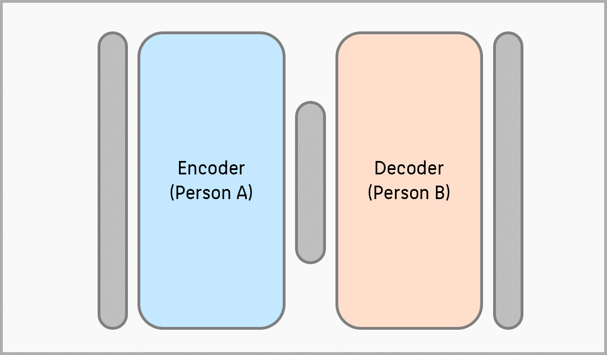

Autoencoder sind eine Art von neuronaler Netzarchitektur, die in den letzten Jahren an Popularität gewonnen hat. Es handelt sich dabei um eine Technik des unüberwachten Lernens, die die Entdeckung von Mustern in Daten ermöglicht, ohne dass dafür markierte Beispiele erforderlich sind. Autoencoder können für eine Vielzahl von Aufgaben eingesetzt werden, darunter Dimensionalitätsreduktion, Merkmalsextraktion und Bilderzeugung. In diesem Artikel werfen wir einen umfassenden Blick auf diese Modelle, ihre Funktionsweise, ihre verschiedenen Typen und ihre Anwendungen.

### Was sind Autoencoder?

Autoencoder sind eine Art von neuronalen Netzwerken, die aus einem Encoder und einem Decoder besteht. Der Kodierer nimmt eine Eingabe auf und ordnet sie einer latenten Raumdarstellung zu, die eine komprimierte Version der Eingabe ist. Der Decoder nimmt dann diese komprimierte Darstellung und versucht, die ursprüngliche Eingabe zu rekonstruieren. Ziel des Autoencoders ist es, eine komprimierte Darstellung der Eingabe zu erlernen, mit der die ursprüngliche Eingabe so genau wie möglich rekonstruiert werden kann.

Der Trainingsprozess eines Autoencoders beinhaltet die Minimierung des Rekonstruktionsverlustes, der die Differenz zwischen der ursprünglichen Eingabe und der rekonstruierten Ausgabe darstellt. Dieser Verlust wird durch das Netzwerk rückgekoppelt, so dass die Gewichte aktualisiert werden und das Netzwerk genauere Darstellungen lernt.

### Wie sieht die Architektur eines Autoencoders aus?

Die Architektur und die Komponenten von Autoencodern spielen eine entscheidende Rolle für ihre Funktionsweise. Das Verständnis dieser Elemente ist wichtig, um zu verstehen, wie diese Modelle funktionieren. Sie bestehen aus mehreren Schlüsselkomponenten, die zusammenarbeiten, um Eingabedaten zu kodieren und zu dekodieren. Die Architektur umfasst in der Regel einen Encoder, einen Decoder und eine Bottleneck-Schicht. Sehen wir uns jede Komponente im Detail an:

**Encoder**: Der Encoder ist der erste Teil eines Autoencoders. Sein Zweck ist die Umwandlung der Eingabedaten in eine komprimierte Darstellung oder einen latenten Raum. Der Encoder wendet eine Reihe von Transformationen an, wie z. B. lineare oder nichtlineare Transformationen, um die Dimensionalität der Eingabedaten zu reduzieren. Diese Reduzierung der Dimensionalität führt zu einer komprimierten Darstellung, die die wichtigsten Merkmale der Eingabedaten erfasst.

**Bottleneck-Schicht**: Die Engpassschicht, die auch als *latenter Raum* (latent space) oder *Repräsentationsschicht* bezeichnet wird, ist die komprimierte Repräsentation, die vom Encoder erhalten wird. Es handelt sich um einen niedrigdimensionalen Raum, in dem die wesentlichen Merkmale der Eingabedaten erfasst werden. Die Engpassschicht fungiert als Engpass oder Einschränkung, die das Modell dazu zwingt, eine kompaktere und effizientere Darstellung zu lernen.

**Decoder**: Der Decoder ist das Gegenstück zum Encoder. Er übernimmt die komprimierte Darstellung aus der Engpassschicht und rekonstruiert die ursprünglichen Eingabedaten. Der Decoder wendet eine Reihe von Transformationen an, in der Regel die Umkehrung der vom Encoder angewandten Transformationen, um die Eingabedaten so getreu wie möglich zu rekonstruieren. 

Das Ziel besteht darin, den Rekonstruktionsfehler zwischen der ursprünglichen Eingabe und der dekodierten Ausgabe zu minimieren. Diese Architektur kann je nach Art und Zweck des Modells variieren. Ein einfacher Autoencoder besteht zum Beispiel aus vollständig verknüpften Schichten, während Faltungsschichten in Faltungs-Autoencodern für Bilddaten verwendet werden. In ähnlicher Weise werden rekurrente Schichten in der rekurrenten Version für sequentielle Daten verwendet.

Durch die Nutzung der Encoder- und Decoder-Komponenten können diese Modelle effiziente Darstellungen der Eingabedaten lernen. Der Kodierer komprimiert die Daten in einen niedriger-dimensionalen Raum, und der Dekodierer rekonstruiert die ursprüngliche Eingabe aus dieser komprimierten Darstellung. Dieser Prozess ermöglicht es ihnen, wichtige (dominanten, relevante) Muster und Merkmale der Daten zu erfassen.

Das Verständnis der Architektur und der Komponenten von Autoencodern ist für die effektive Nutzung und Optimierung dieser Modelle in verschiedenen Anwendungen unerlässlich. Mit diesem Wissen können Praktiker ihre Modelle für spezifische Aufgaben wie Bildentrauschung, Anomalieerkennung, Merkmalsextraktion oder Dimensionalitätsreduktion entwerfen und anpassen.

## Was sind die verschiedenen Arten von Autoencodern?

**Hinweis**: die Auflistung in diesem Unterkapitel enthält fortgeschrittene Inhalte, die vermutlich nur Sinn machen, wenn Sie bereits Vorwissen im Bereich der Neuronalen Netze haben. Wenn dies nicht bereits Teil der Lehrveranstaltung war, betrachten Sie die folgende Auflistung als optionale Anmerkung.
{: .notice--info} 

Es gibt verschiedene Formen von Autoencodern, die jeweils für unterschiedliche Datentypen oder bestimmte Ziele entwickelt wurden. Im Folgenden werden wir einige der gängigsten Typen untersuchen:

* **Vanilla-Autoencoder**: Dieses Modell ist die einfachste Form eines Autoencoders und besteht aus einem Encoder, einer Bottleneck-Schicht und einem Decoder. Es zielt darauf ab, eine komprimierte Darstellung der Eingabedaten zu erlernen, indem es ihre Dimensionalität reduziert und sie dann rekonstruiert. Dieser Typ ist nützlich für Dimensionalitätsreduktion, Rauschunterdrückung und Merkmalsextraktion.
* **Variationaler Autoencoder (VAE)**: Hierbei handelt es sich um ein probabilistisches generatives Modell, das neue, den Eingabedaten ähnliche Daten erzeugen kann. Es macht sich das Konzept der latenten Variablen zunutze und verwendet einen anderen Trainingsansatz als Vanilla-Autoencoder. VAEs werden häufig für die Generierung neuer Bilder, Texte und anderer Datentypen verwendet. Sie werden auch für Aufgaben wie Bildübermalung und Anomalieerkennung verwendet.
* **Convolutional Autoencoder**: Diese Modelle sind speziell für die Verarbeitung und Erzeugung von Bildern konzipiert. Sie verwenden Faltungsschichten im Encoder und Decoder, um räumliche Beziehungen auszunutzen und lokale Muster effektiv zu erfassen. Convolutional Autoencoders werden häufig für Aufgaben wie Bildentrauschung, Bilderzeugung und Extraktion von Bildmerkmalen verwendet.
* **Rekurrente Autoencoder**: Diese eignen sich für die Verarbeitung von sequentiellen oder zeitseriellen Daten. Sie verwenden rekurrente neuronale Netzwerkschichten (RNN) im Encoder und Decoder, um zeitliche Abhängigkeiten zu erfassen und Sequenzen effektiv zu kodieren/dekodieren. Diese Autoencoder finden Anwendung bei Aufgaben wie der Sequenzgenerierung, der Sprachmodellierung und der Erkennung von Anomalien in Zeitreihen.
* **Sparse Autoencoder**: Diese Modelle sind so konzipiert, dass sie spärliche Darstellungen der Eingabedaten erlernen, was bedeutet, dass nur eine Teilmenge der Neuronen in den verborgenen Schichten aktiviert wird. Durch die Förderung der Sparsamkeit können sie aussagekräftigere und robustere Merkmale aus den Daten extrahieren. Sparse-Autoencoder werden häufig für Aufgaben wie die Auswahl von Merkmalen, die Bildklassifizierung und die Erkennung von Anomalien eingesetzt.
* **Denoising-Autoencoder**: Denoising-Modelle werden trainiert, um saubere Daten aus verrauschten Eingaben zu rekonstruieren. Während des Trainings werden dem Modell verfälschte Versionen der Eingabedaten vorgelegt, und das Ziel besteht darin, die ursprünglichen sauberen Daten genau zu rekonstruieren. Sie sind nützlich für die Beseitigung von Rauschen und können auch nützliche Darstellungen der zugrunde liegenden Daten lernen.
* **Adversarialer Autoencoder (AAE)**: Diese Modelle kombinieren die Konzepte von generativen adversen Netzen (GANs) und Autoencodern. AAEs bestehen aus einem Encoder, einem Decoder und einem Diskriminator. Kodierer und Dekodierer zielen darauf ab, die Eingabedaten zu rekonstruieren, während der Diskriminator versucht, zwischen den rekonstruierten und den echten Daten zu unterscheiden. AAEs sind in der Lage, qualitativ hochwertige Muster zu erzeugen und werden für Aufgaben wie Bilderzeugung, unüberwachtes Repräsentationslernen und Datenerweiterung eingesetzt.

Das Verständnis der verschiedenen Arten von Autoencodern ermöglicht es Praktikern, die am besten geeignete Architektur für ihre spezifische Aufgabe oder Datenart zu wählen. Jeder Typ hat seine eigenen Merkmale und Vorteile, die ihn zu einem vielseitigen Werkzeug für eine breite Palette von Anwendungen in der Datenanalyse, Bildverarbeitung, generativen Modellierung und mehr machen.

## Was sind die Anwendungen eines Autoencoders?

Autoencoder sind aufgrund ihrer Vielseitigkeit und ihrer Fähigkeit, sinnvolle Darstellungen aus Daten zu extrahieren, in verschiedenen Bereichen sehr beliebt. Im Folgenden werden einige der wichtigsten Anwendungen vorgestellt:

* **Dimensionalitätsreduktion**: Eine der Hauptanwendungen von Autoencodern ist die Dimensionalitätsreduktion. Durch das Erlernen einer komprimierten Darstellung der Eingabedaten können die Modelle die wichtigsten Merkmale erfassen und irrelevante oder redundante Informationen verwerfen. Diese Reduzierung der Dimensionalität erleichtert nicht nur die effiziente Speicherung und Verarbeitung von Daten, sondern hilft auch bei der Visualisierung und dem Verständnis komplexer Datensätze.
* **Erkennung von Anomalien**: Autoencoder sind wirksam bei der Erkennung von Anomalien oder Ausreißern in Daten. Indem sie die Muster und Regelmäßigkeiten in den Trainingsdaten lernen, können sie die Eingabedaten genau rekonstruieren. Bei anomalen oder unbekannten Daten ist der Rekonstruktionsfehler deutlich höher, was auf das Vorhandensein von Anomalien hinweist. Diese Fähigkeit macht sie in verschiedenen Bereichen wie der Betrugserkennung, der Netzwerksicherheit und der Gesundheitsüberwachung nützlich.
* **Entrauschung und Wiederherstellung von Bildern**: Autoencoder können für die Entrauschung und Wiederherstellung von Bildern eingesetzt werden. Durch das Training des Modells auf einem Datensatz mit sauberen Bildern und dem Einbringen von Rauschen in die Eingabe lernt das Modell, die ursprünglichen, rauschfreien Bilder zu rekonstruieren. Diese Fähigkeit, den ursprünglichen Inhalt von verrauschten Bildern wiederherzustellen, ist bei Anwendungen wie medizinischer Bildgebung, Satellitenbildern und Fotografie sehr nützlich.
* **Bilderzeugung und -synthese**: Generative Modelle auf der Grundlage von Autoencodern, wie z. B. Variations-Autoencodern (VAEs), können neue, realistische Datenproben erzeugen. Diese Modelle lernen die zugrundeliegende Wahrscheinlichkeitsverteilung der Trainingsdaten und können neue Muster durch Stichproben aus der gelernten Verteilung erzeugen. Sie werden häufig für die Erzeugung synthetischer Bilder, Texte und sogar Musik verwendet. Sie finden Anwendung in Bereichen wie kreative Kunst, Inhaltsgenerierung und Datenerweiterung für das Training von Deep-Learning-Modellen.
* **Transfer Learning und Pretraining**: Autoencoder können als vortrainierte Modelle für Transfer-Learning-Aufgaben dienen. Durch das Training eines Autoencoders auf einem großen Datensatz und die Verwendung der gelernten Repräsentationen als Anfangsgewichte für ein anderes Modell können die Leistung und Konvergenzgeschwindigkeit des Zielmodells verbessert werden. Dieser Ansatz ist besonders nützlich, wenn der Zieldatensatz klein ist oder wenn nur wenige beschriftete Daten zur Verfügung stehen.
* **Merkmalsextraktion und Repräsentationslernen**: Autoencoder können zur Extraktion von Merkmalen oder Repräsentationen auf hoher Ebene aus Daten eingesetzt werden. Durch das Trainieren eines Modells für eine bestimmte Aufgabe können die erlernten Repräsentationen relevante und diskriminierende Merkmale erfassen. Diese Merkmale können dann als Input für nachgelagerte Algorithmen des maschinellen Lernens verwendet werden, um die Leistung bei Aufgaben wie Klassifizierung, Clustering und Regression zu verbessern.

Dies sind nur einige Beispiele für die vielfältigen Anwendungen von Autoencodern. Mit der weiteren Erforschung und Verfeinerung von Autoencoder-Architekturen erweitern sich ihre Fähigkeiten in neue Bereiche, was sie zu einem leistungsstarken Werkzeug für verschiedene datengesteuerte Aufgaben und Bereiche macht.

Halt! Falls Sie zügig über diesen Absatz gelesen haben, überlegen Sie mal: der Aspekt der **Dimensionsreduktion** ist das vielleicht wichtigste und mächstigste Feature von Autoencodern. Welche praktischen Anwendungen fallen Ihnen dafür ein? {: .notice--warning}

## Wie werden Deepfakes hergestellt?

Bekanntes Beispiel: [Deep Fakes, welche Festnahmen von Donald Trump zeigen](https://arstechnica.com/tech-policy/2023/03/fake-ai-generated-images-imagining-donald-trumps-arrest-circulate-on-twitter/). Erstellt mit Midjourney, welches im Kern seiner Architektur auf Autoencodern basiert.

Deepfakes sind synthetische Medien, die mit Hilfe von Deep-Learning-Techniken, insbesondere generativen adversen Netzwerken (GANs) und Autoencoder, erstellt werden, um visuelle und akustische Inhalte so zu ersetzen oder zu manipulieren, dass sie authentisch erscheinen. Sie haben aufgrund ihres Potenzials, die Zuschauer zu täuschen und zu manipulieren, große Aufmerksamkeit erregt, was Bedenken hinsichtlich Fehlinformationen und Datenschutz aufkommen lässt.

Deepfakes gewinnen aufgrund der Fortschritte bei den Algorithmen des maschinellen Lernens, der Rechenleistung und der Zugänglichkeit zu ausgefeilten Tools immer mehr an Bedeutung. Mit der Fähigkeit, äußerst realistische und überzeugende gefälschte Videos, Bilder und Audiodateien zu erstellen, stellen Deepfakes eine Herausforderung für die Medienauthentifizierung, die Vertrauenswürdigkeit und die Verbreitung von Desinformationen dar. Daher sind das Verständnis von Deepfakes und die Entwicklung robuster Erkennungsmethoden von entscheidender Bedeutung, um sich gegen ihren Missbrauch zu schützen und die Integrität digitaler Medien zu wahren.

Autoencoder sind maschinelle Lernmodelle, die aus einem Encoder- und einem Decoder-Teil bestehen. Sie werden verwendet, um eine komprimierte, aber informationsreiche Darstellung unstrukturierter Daten zu lernen. Wir können zum Beispiel dasselbe Bild als Eingabe und Ausgabe verwenden. Dies würde es dem Autoencoder ermöglichen, eine möglichst komprimierte Vektordarstellung des Bildes (Code im Diagramm) zu lernen, in der alle wichtigen Merkmale gespeichert sind. Dieser Vektor wird dann vom Decoder verwendet, um daraus wieder das Originalbild zu erzeugen. Je besser die gelernte komprimierte Vektordarstellung des Autoencoders ist, desto realistischer ist das erzeugte (=rekonstruierte) Bild.

Für ein Deepfake werden insgesamt zwei Autoencoder trainiert. Das erste Modell wird mit Bildern oder Videos der Person gefüttert, die im Endprodukt zu sehen sein soll. In den meisten Fällen sind dies Prominente, Politiker oder Sportler, in unserem Beispiel Person A. Das zweite Modell wird mit Bildern einer anderen Person (Person B) trainiert, die die zu imitierende Mimik oder Gestik liefert.

Wenn diese beiden Modelle trainiert sind, verwendet man ein Bild von Person B und kodiert es mit dem Kodierer des zweiten Modells. Der resultierende Vektor wird dann in den Decoder des ersten Modells eingespeist, der ein Bild erzeugt, das wie Person A aussieht, aber die Bewegungen und Gesichtsausdrücke von Person B übernommen hat.

Die sogenannten *Generative Adversarial Networks* sind die zweite Möglichkeit, ein ML-Modell zu trainieren, um Deepfakes zu erstellen. Kurz gesagt, wir trainieren zwei neuronale Netze zusammen. Das erste wird so trainiert, dass es künstliche Bilder erzeugt, die so viele Merkmale wie möglich mit den ursprünglichen Trainingsbildern gemeinsam haben. Das zweite Netzwerk wiederum versucht, die Unterschiede zwischen den künstlich erzeugten Bildern und den Originalbildern zu finden. Wir trainieren also zwei Netze, die miteinander konkurrieren, beide werden besser und besser.

## Was sind die Herausforderungen und Grenzen von Autoencodern?

Autoencoder als leistungsstarke Werkzeuge im Bereich des unüberwachten Lernens und der Dimensionalitätsreduzierung bringen auch eine Reihe von Herausforderungen und Einschränkungen mit sich, die es zu bewältigen gilt. Wenn wir diese Herausforderungen verstehen, können wir Autoencoder in verschiedenen Anwendungen effektiv einsetzen und fundierte Entscheidungen treffen.

Eine der größten Herausforderungen ist das Risiko der Überanpassung. Diese Modelle können, insbesondere bei komplexen Datensätzen oder einer großen Anzahl von Parametern, übermäßig auf die Trainingsdaten spezialisiert werden. Techniken wie Regularisierung, Dropout, frühzeitiges Stoppen oder das Einbringen von Rauschen in die Eingabedaten können helfen, eine Überanpassung zu verhindern und die Generalisierung zu fördern.

Die Auswahl der geeigneten Architektur ist für Autocoder entscheidend. Faktoren wie die Anzahl der Schichten, ihre Größe und die Wahl der Aktivierungsfunktionen wirken sich erheblich auf die Leistung aus. Ein ausgewogenes Verhältnis zwischen Modellkomplexität und Generalisierung ist für optimale Ergebnisse unerlässlich.

Autocoder können zwar aussagekräftige Darstellungen der Eingabedaten erlernen, aber die Interpretation dieser erlernten Merkmale oder das Verständnis der zugrunde liegenden Beziehungen kann eine Herausforderung darstellen, insbesondere bei tiefen oder komplexen Architekturen. Die Interpretierbarkeit der Modelle ist Gegenstand der laufenden Forschung.

Das Training großer Autoencoder-Modelle kann sehr rechenintensiv sein, insbesondere wenn es sich um hochdimensionale Daten oder tiefe Architekturen handelt. Die Berücksichtigung der Berechnungskomplexität und des Ressourcenbedarfs ist von entscheidender Bedeutung, insbesondere in Umgebungen mit begrenzten Ressourcen.

Autoencodern fehlt die explizite Kontrolle über die gelernten Merkmale. Während sie Repräsentationen auf unbeaufsichtigte Weise lernen, kann es eine Herausforderung sein, spezifische Einschränkungen durchzusetzen oder Vorwissen in die gelernten Repräsentationen einzubeziehen.

Ein weiterer Aspekt ist die Generalisierung von ungesehenen Daten. Autoencoder können bei Daten, die außerhalb der Trainingsverteilung liegen, Schwierigkeiten haben, gute Leistungen zu erbringen. Der Einsatz von Regularisierungstechniken und das Training auf unterschiedlichen Daten kann die Generalisierungsfähigkeiten verbessern.

Trotz dieser Herausforderungen finden Autoencoder Anwendung bei der Erkennung von Anomalien, der Bild- und Texterzeugung und beim Lernen von Merkmalen. Wenn man sich ihrer Grenzen bewusst ist, können Praktiker fundierte Entscheidungen treffen und Autoencoder in ihren spezifischen Bereichen effektiv einsetzen.

## Wie erstellt man einen Autoencoder in Python?
Um die Implementierung eines einfachen Autoencoders zu demonstrieren, werden wir den MNIST-Datensatz verwenden, der aus Graustufenbildern handgeschriebener Ziffern und der Python-Bibliothek TensorFlow besteht. Das Ziel des Autoencoders wird es sein, diese Bilder durch das Erlernen einer effizienten Repräsentation zu rekonstruieren.

**Aufgabe**: Verfolgen Sie das Code-Beispiel in im Jupyter Notebook zum [MNIST Autoencoder](/modules/autoencoder/MNIST_Autoencoder.ipynb)
{: .notice--warning} 

## Quellen

Diese Lektion folgt im Wesentlichen dem Text "Was ist ein Autoencoder" von Data Base Camp [Link](https://databasecamp.de/ki/autoencoder) mit kleineren persönlichen Anpassungen.
{: .notice--info}