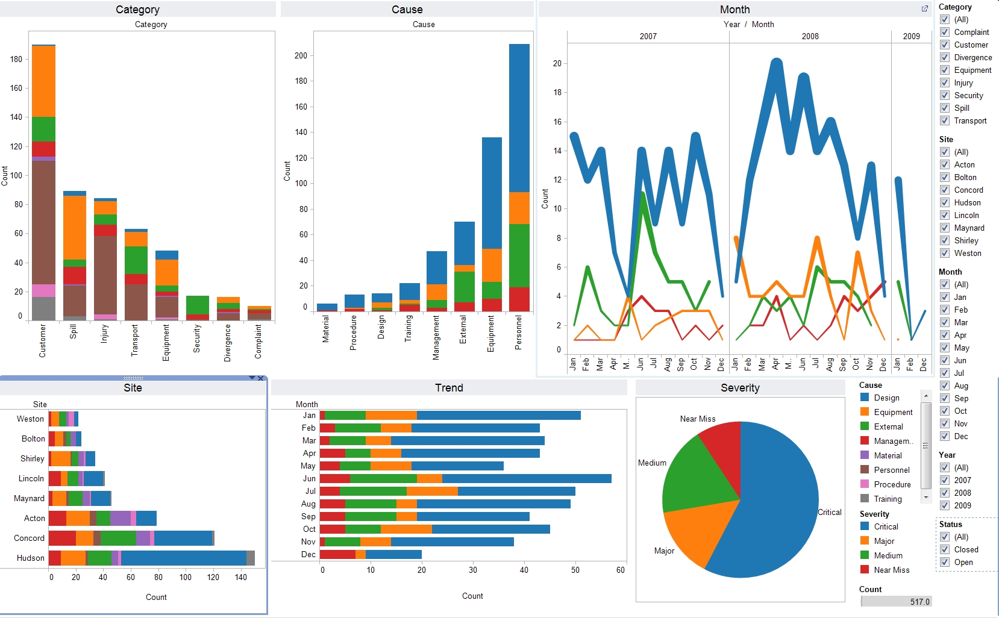

**Business Intelligence** (BI) ist ein entscheidendes Werkzeug in der heutigen Geschäftswelt. Es ermöglicht Unternehmen, Entscheidungen zu treffen, die auf konkreten Daten und nicht auf Vermutungen basieren.
Sogenanntes *data-driven decision making* (oder auf Deutsch: datenbasierte Entscheiden) ist damit ein Schlagwort irgendwo zwischen *Business Bullshit* und einem fundamentalen Wandel in der Unternehmenskultur. 

## Komponenten von Business Intelligence

BI besteht aus mehreren Komponenten:

**Datenbanken und Data Warehouses**: Diese Technologien speichern und organisieren große Mengen von Daten. Ein Data Warehouse ist ein zentralisiertes Repository, das Daten aus verschiedenen Quellen sammelt und diese Daten für Analysen und Berichte organisiert.

*Technisch betrachtet* ist ein Data Warehouse üblicherweise ein Datenbanksystem, welches (strukturierte, modifizierte, aggregierte, ...) inhaltliche Kopien anderer Datenquellen bereitstellt. Die Kopie wird neben dem schnellen Zugriff für die Analytik vor allem erstellt, um das lokale [ERP-System](https://de.wikipedia.org/wiki/Enterprise-Resource-Planning) nicht zu belasten. Im Detail:

* Datenintegration: Ein Data Warehouse sammelt Daten aus verschiedenen internen und externen Quellen. Diese Daten können aus unterschiedlichen Systemen stammen, wie zum Beispiel Transaktionssystemen, relationalen Datenbanken, flachen Dateien oder Online-Datendiensten.
* Datenorganisation: Im Data Warehouse werden die Daten so organisiert und strukturiert, dass sie für Analysen und Berichte leicht zugänglich sind. Dies wird oft durch den Einsatz von Schemata wie dem Sternschema oder dem Schneeflockenschema erreicht.
* Datenkonsolidierung: Ein Data Warehouse konsolidiert die Daten, um eine einheitliche Sicht auf die Geschäftsleistung zu ermöglichen. Es entfernt Duplikate und korrigiert Inkonsistenzen, um die Datenqualität zu gewährleisten.
* Datenhistorisierung: Ein Data Warehouse speichert historische Daten, so dass Trends und Muster über die Zeit hinweg analysiert werden können. Dies ist besonders nützlich für Trendanalysen, Vorhersagen und Entscheidungsfindung.
* Datenabfrage und -analyse: Ein Data Warehouse ermöglicht komplexe Abfragen und Analysen. Es unterstützt sowohl operationale Berichte (wie monatliche Verkaufsberichte) als auch analytische Anwendungen (wie Vorhersagemodelle).

**Data Mining und Analytik**: Data Mining verwendet statistische Modelle und maschinelles Lernen, um Muster in großen Datensätzen zu erkennen (z.B. durch Clustering, Korrelationsanalyse oder Zeitreihen-Dekomposition). Analytik verwendet diese Muster, um Vorhersagen zu treffen (Forecasting, Regression) oder Entscheidungen zu unterstützen. Hinter beiden Begriffen verbirgt sich aber auch der arbeitsintensive manuelle Prozess der Datengewinnung, -transformation, -qualitätssicherung und -bereining. Zum Data Minin gehört deshalb insbesondere auch Methoden des
* [Web Mining](https://de.wikipedia.org/wiki/Web_Mining), special des
* [Social Web Mining](https://www.oreilly.com/library/view/mining-the-social/9781491973547/), des
* [Text Mining](https://de.wikipedia.org/wiki/Textmining), und der
* [Zeitreihenanalyse](https://de.wikipedia.org/wiki/Zeitreihenanalyse). 

**Berichterstattung und Visualisierung**: Diese Komponenten von BI helfen dabei, die Ergebnisse der Datenanalyse in einer leicht verständlichen Form darzustellen:
* Ein **Dashboard** ist eine grafische Benutzeroberfläche, die eine Zusammenfassung von verschiedenen Metriken und Leistungsindikatoren darstellt. Es kann Diagramme, Tabellen, Karten und andere visuelle Elemente enthalten, um die Daten auf eine leicht verständliche Weise darzustellen. Dashboards sind interaktiv und ermöglichen es den Nutzern, die dargestellten Daten zu manipulieren und verschiedene Szenarien zu untersuchen. Sie sind besonders nützlich für Manager und Entscheidungsträger, da sie einen schnellen Überblick über die Leistung des Unternehmens oder spezifischer Geschäftsbereiche bieten. 
* **Reporting** bezieht sich auf den Prozess der Sammlung, Analyse und Darstellung von Daten in einem formatierten Bericht. Berichte können eine Vielzahl von Daten enthalten, von Finanzkennzahlen bis hin zu Verkaufsstatistiken, und sie können in verschiedenen Formaten präsentiert werden, wie z.B. Tabellen, Diagramme oder Text. Im Gegensatz zu Dashboards, die in der Regel in Echtzeit aktualisiert werden, werden Berichte oft in regelmäßigen Abständen erstellt, wie z.B. täglich, wöchentlich oder monatlich. Sie dienen dazu, einen detaillierten Überblick über bestimmte Aspekte des Geschäfts zu geben und können dazu beitragen, Trends zu identifizieren, Leistungen zu bewerten und strategische Entscheidungen zu treffen.

## Anwendung von Business Intelligence

BI wird in einer Vielzahl von Branchen eingesetzt. Im Einzelhandel kann es beispielsweise dazu verwendet werden, Verkaufstrends zu identifizieren und Lagerbestände zu optimieren. In der Fertigung kann BI dazu beitragen, Produktionsengpässe zu identifizieren und die Effizienz zu verbessern.

## Zukunft von Business Intelligence

Mit dem Aufkommen von Technologien wie Künstlicher Intelligenz (KI) und Maschinellem Lernen (ML) werden BI-Systeme immer leistungsfähiger. KI und ML können dazu beitragen, noch genauere Vorhersagen zu treffen und komplexere Analysen durchzuführen.

## Optional: probieren Sie es aus!

Auf dem Markt gibt es einige große Anbieter für etablierte Lösungen. Besonders bekannt (ohne Wertung/Gewichtung oder Empfehlung) sind
* PowerBI
* Qlik
* Tableau.

Im Open Source Bereich ist insbesondere BIRT (auf Basis von Eclipse) bekannt. 

Wenn Sie möchten, nutzen Sie doch einmal die kostenlose Version von PowerBI und [schauen Sie sich ein Beispiel an](https://learn.microsoft.com/en-us/power-bi/create-reports/sample-datasets) oder folgen Sie dem [BIRT tutorial](https://eclipse-birt.github.io/birt-website/). {: .notice--info}
