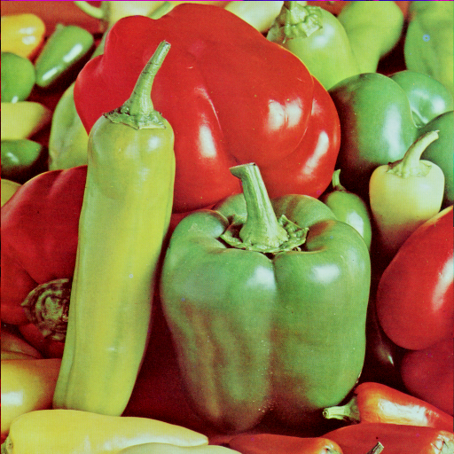

## Bilder mit Python 

Bilddaten machen einen umfangreichen und wichtigen Anteil des digitalen Lebens aus und sind die Grundlage zahlreicher Anwendungsfälle. Die Methoden und Algorithmen zur Verarbeitung von Bilddaten sind teil der Theorie der *Digitalen Bildverarbeitung* oder der *Computer Vision* und können hier nur sehr verkürzt wiedergegeben werden. Wir werden hier jedoch einige wesentliche praktische Techniken zum Arbeiten mit Bildern in Python kennenlernen.


### Pixel verstehen

Computer speichern Bilder als Mosaik aus winzigen Quadraten. Sind diese quadratischen Flächen zu grob, ist es schwierig, glatte Kanten und Rundungen herzustellen, das Bild wirkt "pixelig". Je mehr und kleinere Kacheln wir verwenden, desto glatter wird das Bild. Dies wird üblichweise als *Auflösung* der Bilder bezeichnet.

*Vektorgrafiken* sind eine etwas andere Methode zum Speichern von Bildern, die darauf abzielt, Pixelprobleme zu vermeiden, indem geometrische Formen explizit in ihrer mathematischen Repräsentation gespeichert werden. Aber auch Vektorbilder werden letztlich als Mosaik aus Pixeln am Bildschirm dargestellt. 

Das Wort Pixel beschreibt also ein Bildelement. Eine einfache Möglichkeit, jedes Pixel zu beschreiben, ist die Verwendung einer Kombination aus drei Farben, nämlich Rot, Grün und Blau (sogenanntes RGB-Bild). Wenn alle drei Werte die volle *Intensität* haben, wird ihnen ihr maximaler Farbwert zugewiesen. Die Farbe wird dann als Weiß angezeigt. Wenn alle drei Farben gedämpft sind oder den Wert 0 haben, wird die Farbe als Schwarz angezeigt. Die freie Kombination aller drei Werte ergibt einen bestimmten Farbton der Pixelfarbe:


[Bildquelle](https://towardsdatascience.com/image-data-analysis-using-python-edddfdf128f4)

Da es sich bei jeder Zahl häufig um eine 8-Bit-Zahl handelt, liegen die Werte zwischen 0 und 255.

Diese Zusammenfassung beschreibt die spannende Theorie der Farbräume nur sehr oberflächlich. Wenn Sie tiefer einsteigen möchten, werfen Sie doch einen Blick auf den zugehörigen [Wikipedia-Artikel](https://de.wikipedia.org/wiki/RGB-Farbraum).
{: .notice--info}


Laden wir nun ein Bild und beobachten wir seine verschiedenen Eigenschaften:

```python
 import imageio
 import matplotlib.pyplot as plt
 %matplotlib inline
 pic = imageio.imread("peppers.tiff")
 plt.figure(figsize = (5,5))
 plt.imshow(pic)
```


<br>
Warum dieses Bild?&nbsp; [[Fun Fact 1]](https://en.wikipedia.org/wiki/Lenna)&nbsp;&nbsp;  [[Fun Fact 2]](https://www.tandfonline.com/doi/full/10.1080/09500340.2016.1270881)


 &nbsp;&nbsp;Die weitere Analyse setzen wir in einem [Jupyter Notebook](./Study_Lena.ipynb) fort. **Bitte folgen Sie der Lektion dorthin.**{: .notice--warning}
<br><br><br>


⚑ **Quellenangabe:** Einige Inhalte dieses Artikels und des Notebooks sind manuell ins Deutsche übersetzt aus dem Blog Post ["Image Data Analysis Using Python"](https://towardsdatascience.com/image-data-analysis-using-python-edddfdf128f4) von Yassine Hamdaoui, verfasst Dec 2019, übernommen und mit eigenen Formulierungen und Inhalten ergänzt worden.
{: .notice--info}