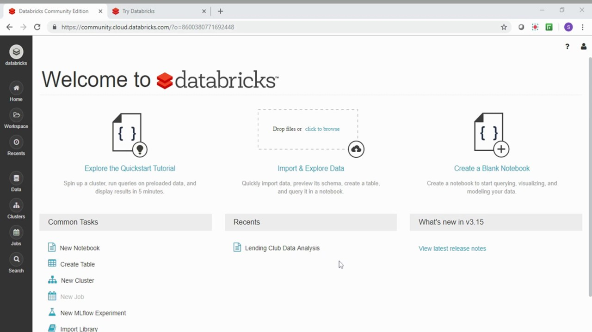
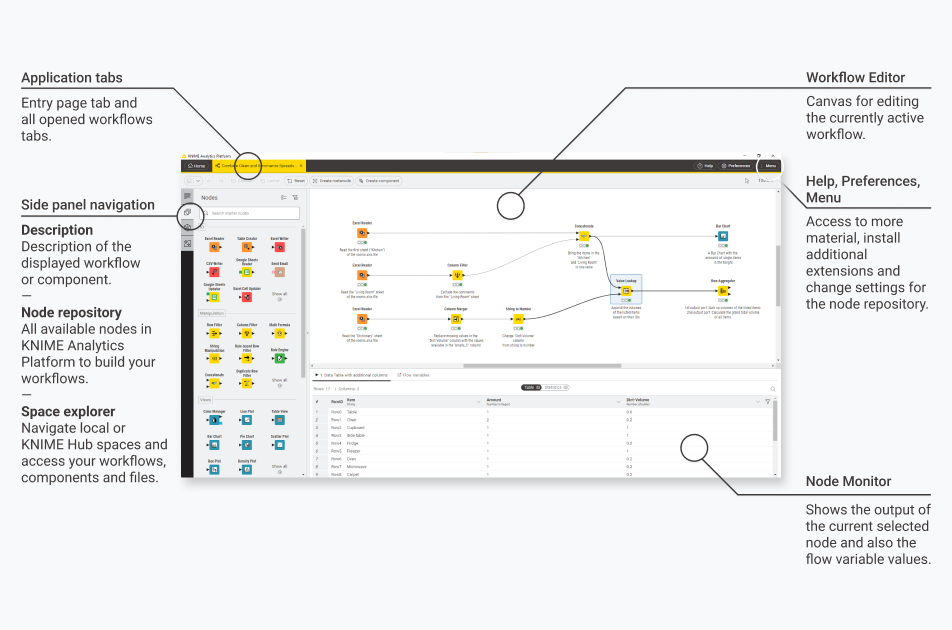

Unternehmen setzen auf datengetriebene Entscheidungen. Data Science wird verwendet, um Einblicke in Geschäftsprozesse zu erlangen, Abläufe zu optimieren oder Prognosen zu erstellen / zu verbessern. Die Herausforderung: nicht immer ist ein Datenexperte zur Hand, manchmal müssen Ergebnisse schnell produziert werden. Manchmal ist dem Domänenexperten auch noch nicht ganz klar, wonach überhaupt gesucht wird.

| _I know it when I see it._

## Citizen Data Science

Wie schafft man es, dass Maschinenexperten, Buchhalter oder CEOs mit Daten umgehen? **Citizen Data Science** soll es  nicht-technischen Mitarbeitern ermöglichen, Datenanalysen durchzuführen. Im Gegensatz zu traditionellen Data Scientists, die meist einen starken Hintergrund in Mathematik, Statistik und Informatik haben, sind Citizen Data Scientists Fachleute aus verschiedenen Unternehmensbereichen, die grundlegende Data Science-Fähigkeiten erwerben, um Datenanalysen eigenständig durchzuführen.

Ziel ist
* Empowerment der Mitarbeiter: Durch Schulungen und den Zugang zu einfach zu bedienenden Tools können Mitarbeiter aus verschiedenen Abteilungen Datenanalysen durchführen und fundierte Entscheidungen treffen.
* Entlastung der Data Science-Teams: Durch die Verlagerung einfacher Datenanalysen auf Citizen Data Scientists können sich professionelle Data Scientists auf komplexere Aufgaben konzentrieren.
* Schnellere Entscheidungsfindung: Da die Mitarbeiter in der Lage sind, Analysen selbst durchzuführen, werden Entscheidungsprozesse beschleunigt.

Typische Probleme sind aber ebenfalls erwartbar:
* Fehlinterpretationen und Datenmissbrauch: Unzureichend geschulte Mitarbeiter könnten Daten falsch interpretieren oder missbrauchen.
* Qualitätskontrolle: Sicherstellung der Qualität und Genauigkeit der durchgeführten Analysen.

## Technische Lösungen

Wie genau muss man sich Data Science ohne Mathe und Informatik vorstellen? Neben einfachen *Reporting Dashboards* gibt es online mittlerweile viele Plattformen für **Self Service Analytics**. Dies ermöglicht es Benutzern, unabhängig von IT-Abteilungen oder Data Science-Teams, Daten zu analysieren und Berichte zu erstellen. 

Die Beispiele für Self Service Analytics Tools sind vielfältig und überlappen teilweise mit den Lösungen für Business Intelligence. Die Begriffe lassen sich nicht klar trennen.
* Tableau: Ein leistungsstarkes Visualisierungswerkzeug, das es Benutzern ermöglicht, Daten leicht zu analysieren und interaktive Dashboards zu erstellen.
* Microsoft Power BI: Ein weiteres weit verbreitetes Tool, das eine breite Palette von Funktionen für die Datenanalyse und -visualisierung bietet.
* Qlik: Bekannt für seine Assoziationsengine, die es Benutzern ermöglicht, Daten auf neue und intuitive Weise zu entdecken.
Bekannte Data Science Plattformen

## Technische Lösungen mit extra Power

### Databricks

Databricks ist eine integrierte Datenanalyseplattform, die auf Apache Spark aufbaut. Sie bietet eine skalierbare Infrastruktur für Big Data-Analysen und maschinelles Lernen.

Hauptfunktionen von Databricks - laut der Anbieterwebseite:

* Skalierbarkeit: Databricks kann große Datenmengen effizient verarbeiten, was es ideal für Big Data-Anwendungen macht.
* Kollaborationsfunktionen: Die Plattform ermöglicht die Zusammenarbeit zwischen Dateningenieuren, Data Scientists und Analysten durch gemeinsame Notebooks und Workspaces.
* Unterstützung für maschinelles Lernen: Integrierte Bibliotheken und Tools erleichtern die Entwicklung und Implementierung von Machine Learning-Modellen.

Bild von der Databricks Website - ein typischer Databricks workspace:

### KNIME

KNIME (Konstanz Information Miner) ist eine Open-Source-Plattform für Datenanalysen, die durch ihre benutzerfreundlichen, visuellen Workflows besticht. Sie ist besonders bekannt für ihre Flexibilität und Erweiterbarkeit durch zahlreiche Plugins.

Hauptfunktionen von KNIME - laut der Anbieterwebseite:

* Visuelle Workflows: Benutzer können Analysen durch Drag-and-Drop-Aktionen erstellen, was die Einstiegshürde für nicht-technische Anwender senkt.
* Erweiterbarkeit: Durch eine Vielzahl von Erweiterungen und Integrationen kann KNIME an spezifische Bedürfnisse angepasst werden.
* Starke Community: Eine aktive Benutzer- und Entwicklergemeinschaft bietet Unterstützung und kontinuierliche Weiterentwicklung der Plattform.

Bild von der KNIME Website - ein typischer KNIME self service workflow:

**Aufgabe:** machen Sie sich mit dem sehr anschaulich beschriebenen Einstieg in KNIME vertraut und folgen Sie dem Tutorial [KNIME - Getting Started](https://www.knime.com/getting-started-guide).  
{: .notice--warning}