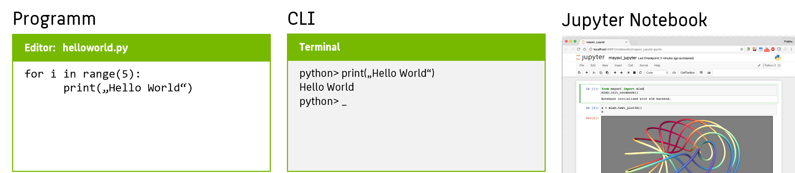

Python hat sich in den letzten Jahren zu einer der beliebtesten Programmiersprachen entwickelt, insbesondere im Bereich der Künstlichen Intelligenz (KI) und Softwareentwicklung. Die Vielseitigkeit, Einfachheit und umfangreiche Unterstützung machen Python zu einer bevorzugten Wahl für Anfänger, Fortgeschrittene und Experten gleichermaßen.
{: .notice--primary}

### Warum Python?
Python zeichnet sich durch eine klare und lesbare Syntax aus, die es Entwicklern ermöglicht, ihre Ideen effizient umzusetzen, ohne sich durch komplizierte Syntaxregeln zu kämpfen. Diese Einfachheit, gepaart mit einer großen Auswahl an Bibliotheken und Frameworks, macht Python ideal für die schnelle Entwicklung von Prototypen, die Erstellung komplexer Anwendungen und die Umsetzung von KI-Algorithmen.

**Aufgabe:** Verbringen Sie ein paar Minuten auf einer der folgenden Seiten. Dort erhalten Sie ein erstes Gefühl für die Python-Syntax:
{: .notice--warning}

* [W3 Python Kurs](https://www.w3schools.com/python/) 
* [Python Cheat Sheet auf einer Seite](https://www.pythoncheatsheet.org/) 
* [Python Cheat Sheet auf einem Blatt Papier](https://perso.limsi.fr/pointal/_media/python:cours:mementopython3-german.pdf)


###  Wie bedient man Python?



Die Bedienung von Python ist intuitiv und leicht zu erlernen. Dank seiner klaren Syntax können Entwickler schnell mit dem Schreiben von Code beginnen, ohne sich zu sehr mit den Feinheiten der Sprache aufhalten zu müssen. Für Data Scientists gibt es ganz unterschiedliche Möglichkeiten, Python zu bedienen:

Mit Python können normale **Anwendungen** zum Beispiel in objektorienter Programmierung entwickelt werden, wie man es von anderen Programmiersprachen auch kennt. Das Python Framework bietet dafür vielfältige Lösungen z.B. für GUIs und Webanwendungen.

In der **interaktiven Python Shell** können Befehle sofort und zeilenweise ausgeführt werden, vergleichbar mit einer Bash Console. Für einfache Data Science-Anwendungen kann dies bereits sehr nützlich sein.

Ein besonderer Modus ist der Umgang mit **Jupyter Notebooks**, die ein Mischform aus diesen beiden Varianten darstellen und eine detaillierte Dokumentierung der Vorgehensweise erlauben. Notebooks sind ein etablierter Standard in der Data Science Welt.


###  Ist Python eine Skriptsprache?
**JA**, Python wird oft als Skriptsprache bezeichnet, da es hervorragend für die Automatisierung von Aufgaben, das Schreiben von Skripten und die Integration in verschiedene Anwendungen geeignet ist.

**NEIN**, denn Python bietet die Flexibilität und Leistungsfähigkeit einer vollwertigen Programmiersprache und eignet sich gleichzeitig ideal für die schnelle Skriptentwicklung.

###  Ist Python langsam?

Es hält sich hartnäckig das Gerücht, dass Python-Code langsam sei. Da Python-Code <em>just-in-time</em> interpretiert wird, ist es im Vergleich zu vorkompilierten Sprachen wie C, C# oder C++ in der unmittelbaren Ausführung langsamer.
Man spart sich dafür aber auch den zeitraubenden Build-Vorgang, und aufgrund der hohen Entwicklerfreundlichkeit viel Lebennszeit in der Entwicklung. Darüber hinaus können kritische Teile von Python-Anwendungen durch Integration von C oder C++ optimiert werden. Für die meisten Anwendungen bietet Python jedoch eine ausgewogene Kombination aus Leistung und Entwicklerfreundlichkeit.

###  Wie installiert man Python?

Die Installation von Python ist an sich einfach und unkompliziert. Python kann von der offiziellen Website heruntergeladen und für verschiedene Betriebssysteme wie Windows, macOS und Linux installiert werden. Es stehen Installationspakete zur Verfügung, die den Prozess so einfach wie möglich gestalten. 

**Achtung!** Sie können Python sehr gern auf diese Weise installieren, der Ressourcenbedarf ist nicht sehr hoch. In vielen Systemen ist Python sowieso bereits vorinstalliert. Es wird jedoch sehr empfohlen, statt der einfachen Installation eine Installation über einen Manager für virtuelle Umgebungen wie z.B. [Anaconda](/modules/howto-anaconda/anaconda.md) zu wählen.
{: .notice--danger}

Wenn Sie Python installiert haben, können Sie es ganz einfach starten, z.B. unter Windows in der Eingabeaufforderung (Linux/OSX: im Terminal):

```
# in cmd.exe
> python.exe
```

In der Python-Shell können Sie sofort losprogrammieren:

```python
# in der Python Shell
print("Hello World")
```

###  Welche IDEs gibt es für Python?
Für die Entwicklung von Python-Anwendungen stehen eine Vielzahl von integrierten Entwicklungsumgebungen (IDEs) zur Verfügung, darunter PyCharm, Visual Studio Code, Atom und viele mehr. Diese IDEs bieten Funktionen wie Code-Vervollständigung, Debugging-Unterstützung, Versionskontrolle und vieles mehr, um die Entwicklung von Python-Anwendungen zu erleichtern.

Insgesamt bietet Python eine ideale Plattform für die Entwicklung von Softwareprojekten aller Art, von einfachen Skripten bis hin zu komplexen KI-Anwendungen. Seine Einfachheit, Vielseitigkeit und umfangreiche Unterstützung machen es zu einer unverzichtbaren Sprache für Entwickler auf der ganzen Welt.