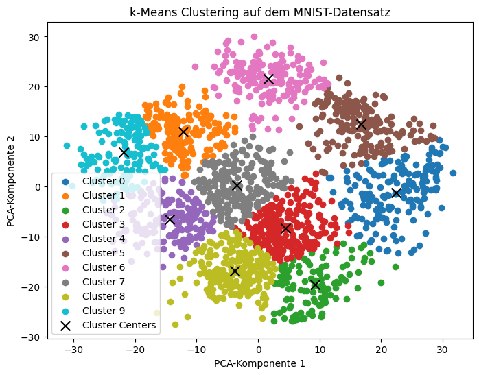

## Definition von Maschinellem Lernen

Maschinelles Lernen (ML) ist ein Teilgebiet der Künstlichen Intelligenz, welches mittlerweile seit Jahrzehnten sehr viel Anwendungsfälle in Unternehmen und Gesellschaft beigesteuert hat. Die Theorie umfasst insbesondere statistischeVerfahren, welche Daten, die in maschinenlesbarer Form vorliegen und Informationen über Beobachtungen oder Erfahrungen enthalten, ein bestimmtes Verhalten lernen. Anders als bei explizit programmierten Verhaltensweisen wird das Lernen direkt aus den Daten abgeleitet. 

## Überwachtes Lernen

Grundsätzlich werden im Maschinellen Lernen zwei wesentliche Arten von Algorithmen unterschieden: beim **Überwachten Lernen** werden bereits in den Lerndaten korrekte Ausgabewerte (sogenannte Label oder Zielvariablen) bereitgestellt.

Innerhalb des Überwachten Lernens unterscheidet man zwei Arten von Algorithmen:
* Bei der **Klassifikation** ist die Zielvariable eine Kategorie. Klassifikationsalgorithmen unterscheiden also Hunde von Katzen, kranke von gesunden Patienten, oder Betrugsfälle von normalem Verhalten.
* Bei der **Regression** ist die Zielvariable numerisch. Regressionsalgorithmen sagen also zum Beispiel Umsatzzahlen vorher, berechnen einen Kredit-Score, oder die Wahrscheinlichkeit für den Ausfall eines Motors.

Die Daten bestehen dabei üblicherweise aus Eingabevektoren mit zugehörigem Ausgabewert (Zielvariable). Die folgende Abbildung fasst typische Bezeichnungen eines Klassifikationsdatensatzes zusammen:


Das folgende Beispiel zeigt, wie man den Perzeptron-Algorithmus verwendet, um handgeschriebene Ziffern zu klassifizieren. Der Datensatz enthält Bilder von Ziffern (0 bis 9), die jeweils als Vektor von Pixelwerten repräsentiert werden. Diese Bilder stammen aus dem sehr berühment [MNIST-Datensatz](https://en.wikipedia.org/wiki/MNIST_database), der in der Programm-Bibliothek selbst verfügbar ist. Der Perzeptron-Klassifikator lernt, diese Bilder zu erkennen und kann anschließen vorherzusagen, welche Ziffer sie darstellen.

```python
import os
import numpy as np
from sklearn.datasets import fetch_openml
from sklearn.linear_model import Perceptron
from sklearn.model_selection import train_test_split
from sklearn.preprocessing import StandardScaler
from sklearn.metrics import accuracy_score

# Laden des MNIST-Datensatzes
mnist = fetch_openml("mnist_784")
X, y = mnist.data, mnist.target

# Aufteilen der Daten in Trainings- und Testsets
X_train, X_test, y_train, y_test = train_test_split(X, y, test_size=0.2, random_state=42)

# Skalieren der Daten
scaler = StandardScaler()
X_train_scaled = scaler.fit_transform(X_train)
X_test_scaled = scaler.transform(X_test)

# Initialisieren des Perzeptron-Klassifikators
clf = Perceptron(max_iter=100, eta0=0.1, random_state=42)

# Trainieren des Modells
clf.fit(X_train_scaled, y_train)

# Vorhersagen auf dem Testset
y_pred = clf.predict(X_test_scaled)

# Berechnen der Genauigkeit
accuracy = accuracy_score(y_test, y_pred)
print(f"Genauigkeit des Perzeptron-Klassifikators: {accuracy:.2f}")

```

Im Code werden Sie sehen, dass der Original-Datensatz zuerst in die Merkmale $X$ und Zielvariable $y$ aufgeteilt wurden. Anschließend wurde erneut aufgeteilt in Trainings- und Testdaten. Dies ist ein typischese Vorgehen im Maschinellen Lernen: die Trainingsdaten werden verwendet, um mit dem Modell einen statistischen Zusammenhang zwischen Input und Output zu lernen. In den Testdaten wird der Output zurückgehalten (vor dem Modell verborgen), um die Korrektheit des Modells zu überprüfen. In der Theorie des Maschinellen Lernens gibt auch komplexere Vorgehensweisen, um die Qualität eines Modells möglichst zuverlässig bewerten zu können.

## Unüberwachtes Lernen

Im Gegensatz zum Überwachten Lernen wird beim **Unüberwachten Lernen** Algorithmen nach irgendiwe auffälligen Mustern in den Daten gesucht, ohne dass Zielvariablen mit der korrekten Lösung zur Verfügung stehen. Auch hier unterscheiden wir mehrere Teilkategorien:

* **Clustering**: Unbekannte Gruppen, Strukturen und Ähnlichkeiten zwischen den Stichproben in den Daten aufdecken.
* **Dimensionality Reduction**: Strukturelle Eigenschaften aufdecken, um Daten zu vereinfachen und visuell explorierbar zu machen. Hochdimensionale Daten mit geringem Fehler in 2D- oder 3D-Grafiken darstellen.
* **Association Analysis**: Gemeinsames Auftreten von Mustern, z.B. für Warenkorbanalyse.


Der folgende Code arbeitet ebenfalls mit dem MNIST-Datensatz. Dort hat jedes Bild eine Größe von 28 x 28 Pixeln. Anstatt aber direkt auf den 784 Pixeln (=Merkmalen) zu arbeiten, wird die Dimensionalität der Datenmatrix mit Hilfe einer *Prinipal Component Analysis* auf 2 Merkmale reduziert. Wesentliche Ähnlichkeiten zwischen den Bildern bleiben dabei jedoch erhalten! Im dimension-reduzierten Datensatz wird nun mit Hilfe des *k-Means* Algorithmus nach zehn Clustern gesucht.

```python
# Importieren der benötigten Bibliotheken
import numpy as np
import matplotlib.pyplot as plt
from sklearn.datasets import load_digits
from sklearn.cluster import KMeans
from sklearn.decomposition import PCA

# Laden des MNIST-Datensatzes
digits = load_digits()
X = digits.data

# Reduzieren der Dimensionalität mit PCA
pca = PCA(n_components=2)
X_pca = pca.fit_transform(X)

# Anwenden von k-Means-Clustering
kmeans = KMeans(n_clusters=10, random_state=42)
kmeans.fit(X_pca)

# Visualisierung der Cluster
plt.figure(figsize=(8, 6))
for i in range(10):
    plt.scatter(X_pca[kmeans.labels_ == i, 0], X_pca[kmeans.labels_ == i, 1], label=f"Cluster {i}")
plt.scatter(kmeans.cluster_centers_[:, 0], kmeans.cluster_centers_[:, 1], color='black', marker='x', s=100, label='Cluster Centers')
plt.title("k-Means Clustering auf dem MNIST-Datensatz")
plt.xlabel("PCA-Komponente 1")
plt.ylabel("PCA-Komponente 2")
plt.legend()
plt.show()

```



Die zwei Dimensionen der PCA kann man bequemerweise leicht plotten (genau deshalb wurde die Zahl 2 gewählt, eine PCA unterstützt grundsätzlich beliebig-dimensionale Räume). In dem resultierenden zweidimensionalen Bild wurden die Ziffernbilder als Punkt, eingefärbt nach ihrer Clusternummer, abgebildet.

**Achtung:** Zum besseren Verständnis sei hier noch bemerkt, dass das Clustering *nicht* die im Bild dargestellte Ziffer identifiziert. In Cluster 0 sind also nicht zwingend Bilder der Ziffer 0 enthalten. Die Clusternummer beschreibt hier lediglich einen laufenden Index - unüberwachte Verfahren haben generell keine Kenntnis von irgendwelchen Zielvariablen.
{: .notice--info} 


## Weitere Formen


In Ergänzung zu diesen beiden Arten gibt es weitere Kategoriern von Algorithmen: so basiert zum Beispiel das bestärkende Lernen (Reinforcement Learning) auf kontinuierlichem Feedback, ohne vorgegebene Ausgabewerte. Auch gibt es hybride Formen zwischen den Kategorien. Abschließend werden auch viele Methoden zur Visualisierung, Manipulation und Qualitätssicherung von Daten zum Feld des Maschinellen Lernens gezählts, wodurch sich Feld mit der Definition von *Data Science* überlappt - eine scharfe Abgrenzung zwischen beiden Feldern ist nicht möglich.


