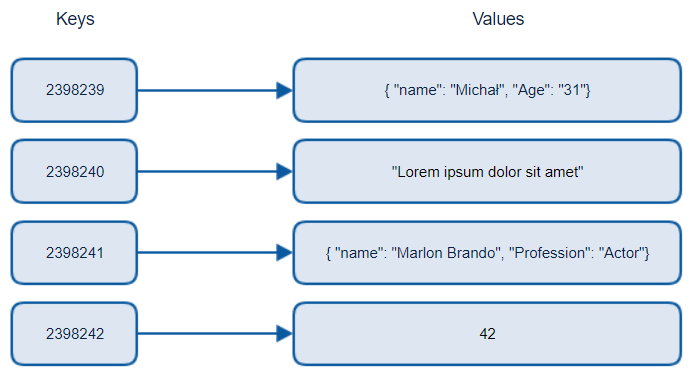
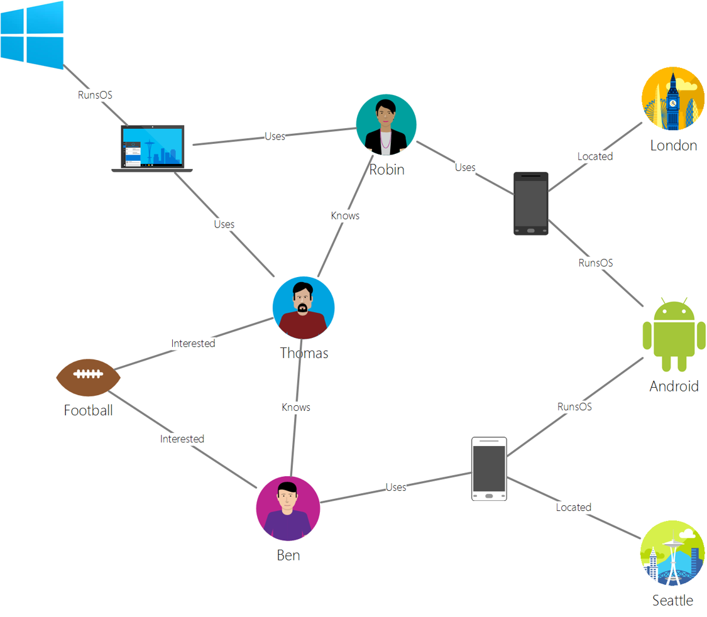

Daten müssen nicht immer in klassischen relationalen Datenbanken liegen. In dieser Lektion behandeln wir die  nicht-strukturierte Daten und die Grundlagen von noSQL.

## NoSQL

NoSQL ist ein Überbegriff, um nicht-relationale Daten als Sonderfall von nicht-strukturierten Daten zu bezeichnen. Der Begriff lässt sich übersetzen mit "non-SQL", "non-relational" oder auch  "not only SQL".  NoSQL-Datenbanken unterscheiden sich vor allem in der Weise, wie sie die Daten intern organisieren:

### Key-value Datenbanken


Source from [Michał Białecki Blog](https://www.michalbialecki.com/2018/03/18/azure-cosmos-db-key-value-database-cloud/)

**Key-value databases** koppeln eindeutige Schlüssel mit einem zugeordneten Wert. Werte können Skalardatentypen wie Ganzzahlen oder komplexe Strukturen wie JSON, Listen oder BLOBs sein. Die Paare werden mithilfe einer [Hash Tabelle](https://www.hackerearth.com/practice/data-structures/hash-tables/basics-of-hash-tables/tutorial/) und einer entsprechenden Hashing-Funktion gespeichert. Die in diesen Datenbanken dargestellten Daten ähneln dem bekannten Datentyp Dictionary. Im Gegensatz zu relationalen Datenbanken können *Werte* in Key-Value-Datenbanken deshalb üblicherweise nicht (effizient) abgefragt oder durchsucht werden. Nur der Schlüssel kann abgefragt werden.

Das folgende sehr kompakte Beispiel zeigt, wie man dictionary-artige Daten in einer bekannten key-value-DB, Redis, verwalten kann:


```python
import redis

# Verbindung zur Redis-Datenbank herstellen
r = redis.Redis(host='localhost', port=6379, db=0)

# Beispiel-Daten: Ein Benutzer und seine Hüte
alice = {
    'name': 'Alice',
    'age': 30,
    'hats': [
        {'color': 'red', 'style': 'fedora'},
        {'color': 'blue', 'style': 'beanie'}
    ]
}

# Daten in Redis speichern
r.hmset('user:1', alice)

# Daten aus Redis abfragen
user_data = r.hgetall('user:1')

# Ausgabe der abgerufenen Daten
print(f"Name: {user_data[b'name'].decode('utf-8')}")
print(f"Alter: {user_data[b'age'].decode('utf-8')} Jahre")
print("Hüte:")
for hat in eval(user_data[b'hats'].decode('utf-8')):
    print(f"  - Farbe: {hat['color']}, Stil: {hat['style']}")

```

### Dokumenten-orientierte Datenbanken

Technologisch sehr nahe verwandt mit Key-Value-Datenbanken sind **Dokumentenorientierte Datenbanken**. Da sehr viele NoSQL-Technolgien auf eine key-value-artige Datenverwaltung zurückgreifen, sorgt die [scharfe Trennung der Kategorien manchmal für Schwierigkeiten](https://www.mongodb.com/databases/key-value-database).

Key-value-Datenbanken  ermöglichten durch die Verwendung von Hash-Funktionen sehr schnellen Zugriff (O(1)) in großen Datenmengen. Dokumentenorientierte Datenbanken speichern Daten in Form von „Objekten“, deren Eigenschaften geändert, hinzugefügt, gelöscht und abgefragt werden können. Da die Eigenschaften selbst Namen (*key*) und Werte (*value*) haben, erinnern die Datenbanken"optisch" stark an Key-Value-DBs.

Hier ein typisches Beispiel für ein Dokument:

```json
{
    "firstname": "Eva",
    "age": 44,
    "id": "8c74a315-aebf-4a16-bb38-2430a9896ce5",
    "_rid": "bHwDAPQz8s0BAAAAAAAAAA==",
    "_self": "dbs/bHwDAA==/colls/bHwDAPQz8s0=/docs/bHwDAPQz8s0BAAAAAAAAAA==/",
    "_etag": "\"00000000-0000-0000-9f95-010a691e01d7\"",
    "_attachments": "attachments/",
    "_ts": 1630544034
}
```
Das folgende Beispiel zeigt, wie man ein gewöhnliches Python Dictionary in einer bekannten noSQL-Datenbank (MongoDB) ablegen kann:

```python
# Import the required libraries
from pymongo import MongoClient

# Create a connection to the MongoDB server
client = MongoClient('mongodb://localhost:27017/')

# Select the database and the collection
db = client['myDatabase']
collection = db['myCollection']

# Create a dictionary
my_dict = {"name": "Max", "age": 30, "job": "Engineer"}

# Save the dictionary in the database
collection.insert_one(my_dict)

```
Ein etwas umfangreicheres Beispiel können Sie [optional hier finden](https://www.mongodb.com/languages/python).

Dokumentenorientierte-Datenbanken haben hochinteressante Eigenschaften im Bezug auf Skalierung auf verteilten Systemen, Datenaggregation sowie Zuverlässigkeit und Geschwindigkeit der Datenverwaltung, die sich deutlich von klassischen Relationalen Datenbanksystemen unterscheidet. Für weiterführende Informationen dazu und konkret zum Umgang mit MongoDB sei hier die [Dokumentation des Herstellers](https://www.mongodb.com/docs/) empfohlen.

### Graph-Datenbanken


Source from [Microsoft](https://docs.microsoft.com/en-us/azure/cosmos-db/graph/graph-introduction#graph-database-by-example)

**Graph-Datenbanken** beschreiben Beziehungen in Daten und werden als Sammlung von Knoten und Kanten dargestellt. Ein Knoten stellt eine Entität dar, also etwas, das in der realen Welt existiert, beispielsweise ein Student, oder ein Kontoauszug. Kanten stellen die Beziehung zwischen zwei Entitäten dar. Jeder Knoten und jede Kante verfügt über Eigenschaften, die zusätzliche Informationen bereitstellen.

Wenn Sie mehr über die Vor- und Nachteile sowie typische Einsatz-Szenarien von Graphdatenbanken erfahren möchten, ist [dieser kurze Blogartikel](https://pythonsimplified.com/introduction-to-graph-databases/) sehr hilfreich.

Der folgende Code demonstriert sehr kompakt, wie man mit Python mit einer sehr bekannten Graph-Datenbank, Neo4J, interagiert:

* Wir erstellen zwei Benutzerknoten mit den Namen “Alice” und “Bob”.
* Wir erstellen eine Freundschaftsbeziehung zwischen ihnen.
* Die Methode `query_friends` fragt die Freundschaftsbeziehung zwischen beiden ab.

```python
from neo4j import GraphDatabase

class Neo4jExample:
    def __init__(self, uri, user, password):
        self.driver = GraphDatabase.driver(uri, auth=(user, password))

    def close(self):
        self.driver.close()

    def create_nodes_and_relationship(self):
        with self.driver.session() as session:
            # Erstelle zwei Benutzerknoten
            session.run("CREATE (:User {name: 'Alice'})")
            session.run("CREATE (:User {name: 'Bob'})")

            # Erstelle eine Freundschaftsbeziehung zwischen Alice und Bob
            session.run("MATCH (alice:User {name: 'Alice'}), (bob:User {name: 'Bob'}) "
                        "CREATE (alice)-[:FRIENDS]->(bob)")

    def query_friends(self):
        with self.driver.session() as session:
            result = session.run("MATCH (user:User)-[:FRIENDS]->(friend) "
                                "RETURN user.name, friend.name")
            for record in result:
                print(f"{record['user.name']} ist befreundet mit {record['friend.name']}")

if __name__ == "__main__":
    neo4j_uri = "bolt://localhost:7687"
    neo4j_user = "neo4j"
    neo4j_password = "dein_passwort"

    neo4j_example = Neo4jExample(neo4j_uri, neo4j_user, neo4j_password)
    neo4j_example.create_nodes_and_relationship()
    neo4j_example.query_friends()
    neo4j_example.close()

```

### Weitere Arten

NoSQL-Datenbanken sind eine vielseitige Gruppe von Datenbanken, die sich vom traditionellen relationalen Ansatz abheben. Ihre individuelle Funktionsweise ist ausgerichtet auf bestimmte Anwendungstypen, die Übergänge zwischen den Kategorien und zu anderen Technologien sind teilweise fließend. Hier sind einige weitere NoSQL-Datenbanktypen:

* Spaltenorientierte Datenbanken
  * Diese speichern Daten in Spalten anstelle von Zeilen.
  * Sie sind effizient für Analysen und Aggregationen, da sie nur die benötigten Spalten laden.
  * Ein Beispiel ist Cassandra1.
* Wide-Column-Stores
  * Ähnlich wie spaltenorientierte Datenbanken, aber mit flexibleren Schemas.
  * HBase ist ein bekanntes Beispiel.
* Zeitreihendatenbanken
  * Spezialisiert auf die effiziente Speicherung und Abfrage von Zeitreihendaten (z. B. Sensordaten, Logdaten).
  * InfluxDB ist ein gutes Beispiel.
* Objektspeicher (Object Stores)
  * Diese speichern große Mengen unstrukturierter Daten (z. B. Bilder, Videos) als Objekte.
  * Amazon S3 und Google Cloud Storage sind bekannte Objektspeicher.
* Suchmaschinen (Search Engines)
  * Diese ermöglichen schnelle Volltextsuche und Indizierung.
  * Elasticsearch und Solr sind populäre Suchmaschinen.
* Schlüssel-Wert-Graph-Hybride:
  * Kombinieren Schlüssel-Wert- und Graphdatenbankansätze.
  * ArangoDB ist ein Beispiel.


## Self Study

* Diese Übersicht zu [Non-relational Data and NoSQL](https://docs.microsoft.com/en-us/azure/architecture/data-guide/big-data/non-relational-data) geht auf die individuellen Eigenschaften einiger der hier genannten Typen ein.
* In den jeweiligen Dokumentationen der Hersteller finden Sie üblicherweise weiterführende Informationen zur internen Datenverwaltung und zu passenden Anwendungsfeldern.

