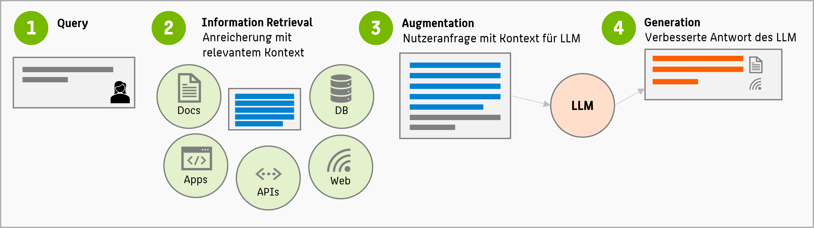

Der Umgang mit Large Language Models (LLMs) wie ChatGPT ist Ihnen sicherlich aus dem Alltagsgebrauch bekannt. Diese Modelle stellen aktuell Anwendungsfälle für die größten weltweit bekannten neuronalen Netze dar. Derzeit wird sehr viel Forschung betrieben, um die Qualität des Outputs dieser Netze zu verbessern.

Ein wesentlicher Nachteil von LLMs ist, dass sie zeitlich fixiert sind. Da ihre Parameter (wie bei jedem neuronalen Netz) nach dem Training unveränderlich sind, verfügt ein LLM nur über Weltwissen bis zum Zeitpunkt des Trainings. Eine einfache Methode, um damit umzugehen, ist **Retrieval Augmented Generation** (RAG)-

Retrieval Augmented Generation (RAG) ist ein fortschrittlicher Ansatz im Bereich der künstlichen Intelligenz, der darauf abzielt, die Qualität und Relevanz von generierten Texten zu verbessern. Diese Methode kombiniert zwei wichtige Techniken: Information Retrieval (IR) und Textgenerierung (Generation).

Die Idee ist einfach:

Information Retrieval bezieht sich auf den Prozess des Abrufens relevanter Informationen aus großen Datensätzen. Im Kontext von RAG werden große Wissensdatenbanken oder Informationsquellen verwendet, um relevante Informationen für eine gegebene Eingabeabfrage zu finden (siehe Grafik, zweiter Schritt). Dies können beispielsweise Wikipedia-Artikel, Fachbücher oder Online-Datenbanken oder eben Wissensquellen im unternehmerischen Kontext sein. 

Der (1) einfache Query eines Nutzers soll durch RAG mit zusätzlichen Informationen angereichert (augmentiert) werden. Dafür werden diese von einem Orchestrieurungssystem (d.h. einer unternehmensspezifischen Software) aus den verfügbaren Wissensquellen gesucht und ggf. zusammengefasst. Dies passiert mit herkömmlichen Methoden des Information Retrievals (2). Das LLM erhält stattdessen ein deutlich größeres, informationshaltigeres Prompt (3) und kann dadurch eine verbesserte Antwort generieren (4).

Die Vorteile dieser Methode sind vielfältig:
* das LLM erhält zusätzliche (aktuelle) Fakten für die Formulierung seiner Antworten
* Prompts an das LLM können mit zusätzlichen Informationen ausgestattet werden 
* spart Re-Training oder Finetuning des LLMs
* reduziert Halluzinationen
* ermöglicht dem LLM das Nennen von Quellen

