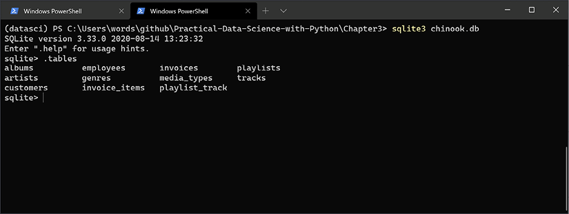
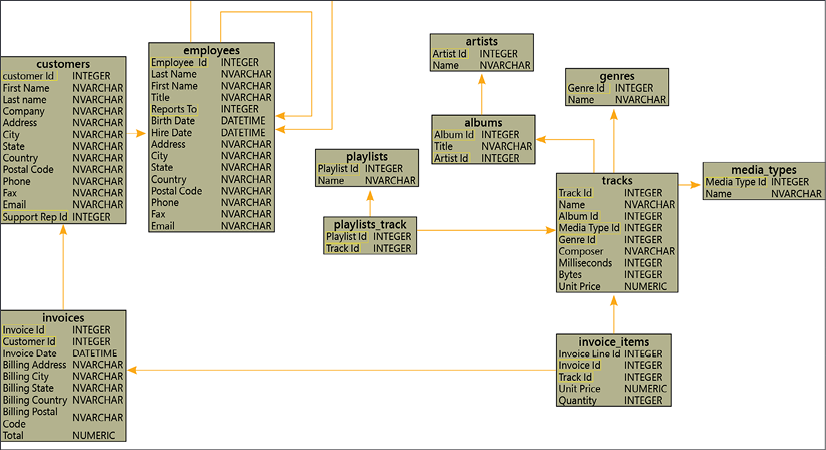

**SQL** oder **Structured Query Language** ist eine Programmiersprache für die Interaktion mit Daten in relationalen Datenbanken (manchmal auch RDBMS genannt, was „Relational Database Management System“ bedeutet). SQL gibt es seit den 1970er Jahren und wird auch heute intensiv verwendet. 

SQL ist die Standardprogrammiersprache für die Schnittstelle zu relationalen Datenbanken, und ein großer Teil der Daten und Datenbanken verwendet heutzutage relationale Modelle. 

Fall Ihnen das [Entity Relationship Model](https://de.wikipedia.org/wiki/Entity-Relationship-Modell) und generell Ansätze der relationalen Datenmodellierung fremd sind, sollten Sie dies ggf. zeitnah an anderer Stelle vertiefen.


Tatsächlich wurde SQL sogar von der *International Organization for Standardization (ISO)* als internationaler Standard anerkannt und der SQL-Standard wird alle paar Jahre kontinuierlich aktualisiert. NoSQL-Datenbanken sind eine Alternative zu SQL-Datenbanken und werden in Situationen verwendet, in denen wir möglicherweise mehr Flexibilität in unserem Datenmodell oder ein völlig anderes Modell (z.B. eine Diagrammdatenbank) bevorzugen. Wenn wir beispielsweise nicht sicher sind, welche Spalten oder Felder wir möglicherweise mit unseren Daten erfassen (und diese sich im Laufe der Zeit häufig ändern können), ist eine NoSQL-Dokumentendatenbank wie MongoDB möglicherweise besser als SQL. Bei Big Data hatte NoSQL früher einen Vorteil gegenüber SQL, da NoSQL horizontal skalieren konnte (d. h. einem Cluster mehr Knoten hinzufügen konnte). Mittlerweile wurden SQL-Datenbanken für eine einfache Skalierung entwickelt, und wir können auch Cloud-Dienste wie AWS Redshift und Googles BigQuery nutzen, um SQL-Datenbanken einfach zu skalieren.

Ein Großteil der weltweiten Daten wird mithilfe von SQL in relationalen Datenbanken gespeichert. Es ist wichtig, die Grundlagen von SQL zu verstehen, damit wir unsere eigenen Daten für unsere datenwissenschaftliche Arbeit abrufen können. Wir können über die Befehlszeile oder GUI-Tools sowie über Python-Pakete wie Pandas und SQLAlchemy direkt mit SQL-Datenbanken interagieren. Aber zuerst üben wir SQL mit SQLite-Datenbanken, da SQLite3 mit Python installiert ist. SQLite ist das, wonach es sich anhört – eine schlanke Version von SQL. Es fehlt die umfangreichere Funktionalität anderer SQL-Datenbanken wie MySQL, sie ist jedoch schneller und einfacher zu verwenden. Es kann jedoch immer noch eine Menge Daten speichern, wobei die maximale potenzielle Datenbankgröße für SQLite-Datenbanken etwa 281 TB beträgt.

## Verwendung von SQLite und SQL

Für unsere nächsten Beispiele verwenden wir die `Chinook`-Datenbank. Dabei handelt es sich um einen Datensatz mit Liedern und Einkäufen von Kunden, der einem Datensatz mit iTunes-Liedern und -Käufen ähnelt. Wir werden diesen Datensatz gelegentlich als „iTunes-Datenbank“ bezeichnen. Die Datei „chinook.db“ und der zugehörige der Quellcode  sind unter https://github.com/lerocha/chinook-database zu finden. 

Laden wir zunächst die Datenbank über die Befehlszeile und werfen einen Blick darauf. Öffnen Sie ein Terminal oder eine Shell und navigieren Sie zu dem Verzeichnis, das die Datei `chinook.db` enthält. Führen Sie dann den folgenden Befehl aus, um die Datenbank in einer SQLite-Shell zu öffnen:

```
sqlite3 chinook.db
```
Versuchen wir es mit unserem ersten Befehl: `.tables`. Dadurch werden die Tabellen in der Datenbank ausgedruckt, die die Daten enthalten. Unser Ergebnis sollte wie folgt aussehen:



SQL-Datenbanken sind in Tabellen organisiert, die kombiniert werden können, um mehr Informationen zu extrahieren. Wir können ein Entity-Relationship-Diagramm (ERD) der Datenbank zeichnen, das die Tabellen und ihre Beziehungen untereinander zeigt:



Das vorangehende ERD zeigt die Tabellen, die wir aus der Chinook-Datenbank aufgelistet haben. Die Pfeile zeigen, welche Tabellen mit anderen Tabellen verbunden sind, und die hervorgehobenen/eingerahmten Spaltennamen zeigen die gemeinsamen Spalten, die sie verbinden können. Diese Verbindungsspalten haben übereinstimmende Werte, die gepaart werden können, um Zeilen aus den verschiedenen Tabellen zu kombinieren.

Versuchen wir es mit einem einfachen Befehl in unserer SQLite-Shell. Um Daten aus einer SQL-Datenbank abzurufen, können wir den SELECT-Befehl verwenden. Schauen wir uns einige Daten aus der Künstlertabelle an:

```
SELECT * FROM artists LIMIT 5;
```

Konventionell werden SQL-Befehle in Großbuchstaben eingegeben, obwohl dies nicht unbedingt der Fall sein muss, und beim Text in SQL-Befehlen wird die Groß-/Kleinschreibung nicht beachtet. Die im vorherigen Codeausschnitt gezeigten Befehle SELECT, FROM und LIMIT sind also die spezifischen SQL-Befehle, die wir verwendet haben. SELECT teilt der SQL-Shell mit, welche Spalten ausgewählt werden sollen. Mit * markieren wir alle Spalten. Beachten Sie, dass wir aus der ERD ersehen können, dass unsere verfügbaren Spalten in der Künstlertabelle ArtistId und Name sind. Als nächstes wählen wir die Tabelle aus, aus der wir unsere Daten auswählen möchten – VON Künstlern. Schließlich begrenzen wir unsere Ergebnisse mit LIMIT 5 auf 5, damit nicht alle Ergebnisse ausgedruckt werden (was sehr umfangreich sein könnte).

Beachten Sie bitte, dass wir die Zeile mit einem Semikolon beenden. Ohne das Semikolon sucht die SQL-Shell ständig nach mehr auszuführendem Code. Wir sollten ausgedruckte Ergebnisse wie die folgenden sehen:


```
1|AC/DC
2|Accept
3|Aerosmith
4|Alanis Morissette
5|Alice In Chains
```

Die zurückgegebenen Ergebnisse werden innerhalb der SQLite-Shell minimal formatiert. Es werden nicht einmal die Spaltennamen angezeigt, aber wir kennen sie aus dem ERD oder aus der Spaltenliste der Tabelle. Wir können uns die Liste der Spalten mit dem Befehl `PRAGMA table_info(artists)` ansehen.

Um die SQLite-Shell zu verlassen, drücken Sie Strg + C.

## SQL in Python

Wenn wir eine SQLite-Datei haben, können wir über die Befehlszeile oder andere Software wie SQLiteStudio mit ihr interagieren. Wir können es jedoch auch mit Python verwenden, indem wir das integrierte sqlite3-Modul verwenden. Um mit dieser Methode zu beginnen, importieren wir sqlite3, stellen dann eine Verbindung zur Datenbankdatei her und erstellen einen Cursor:

```python
import sqlite3
connection = sqlite3.connect('chinook.db')
cursor = connection.cursor()
```

Das Zeichenfolgenargument für `sqlite3.connect()` sollte entweder der relative oder der absolute Pfad zur Datenbankdatei sein. Der relative Pfad bedeutet, dass er relativ zu unserem aktuellen Arbeitsverzeichnis ist (von dem aus wir den Python-Code ausführen). Wenn wir einen absoluten Pfad verwenden möchten, könnten wir etwa Folgendes angeben:

```python
connection = sqlite3.connect(r'C:\Users\my_username\github\chinook.db')
```

Beachten Sie, dass vor der Zeichenfolge das Zeichen `„r“` steht. Wie bereits erwähnt, steht dies für Raw String und bedeutet, dass Sonderzeichen (wie der Backslash, \) als Literalzeichen behandelt werden. Bei unformatierten Strings ist der Backslash einfach ein Backslash, und das ermöglicht uns, Dateipfade aus dem Windows-Datei-Explorer zu kopieren und in Python einzufügen.

Der vorangehende Cursor ermöglicht es uns, SQL-Befehle auszuführen. Um beispielsweise den SELECT-Befehl auszuführen, den wir bereits in der SQLite-Shell ausprobiert haben, können wir den Cursor verwenden:

```python
cursor.execute('SELECT * FROM artists LIMIT 5;')
cursor.fetchall()
```

Wir verwenden die Funktion fetchall, um alle Ergebnisse der Abfrage abzurufen. Es gibt auch die Funktionen fetchone und fetchmany, die wir stattdessen verwenden könnten und die in der sqlite3-Dokumentation von Python beschrieben sind. Diese Funktionen rufen einen Datensatz (fetchone) und mehrere Datensätze ab (fetchmany, wodurch eine von uns angegebene Anzahl von Datensätzen abgerufen wird).

Wenn wir mit der Ausführung größerer SQL-Abfragen beginnen, ist es hilfreich, diese anders zu formatieren. Wir können einen SQL-Befehl wie folgt in mehrere Zeilen aufteilen:

```python
query = """
SELECT *
FROM artists
LIMIT 5;
"""
cursor.execute(query)
cursor.fetchall()
```

Wir verwenden eine mehrzeilige Zeichenfolge für die Abfragevariable mit dreifachen Anführungszeichen und setzen jeden SQL-Befehl in eine separate Zeile. Dann übergeben wir diese String-Variable, query, an die Funktion `cursor.execute()`. Abschließend rufen wir die Ergebnisse mit `fetchall()` ab.

Bei der Auswahl von Daten kann es sinnvoll sein, diese nach einer der Spalten zu sortieren. Schauen wir uns die Rechnungstabelle an und ermitteln die größten Rechnungen:

```python
cursor.execute(
    """SELECT Total, InvoiceDate
    FROM invoices
    ORDER BY Total DESC 
    LIMIT 5;"""
)
cursor.fetchall()
```

Hier verwenden wir dieselbe Verbindung und denselben Cursor wie zuvor. Wir wählen einige Spalten aus Rechnungen aus: `Total` und `InvoiceDate`. Anschließend verwenden wir den SQL-Befehl ORDER BY und sortieren nach der Spalte „Gesamt“ mit dem Zusatz DESC für absteigende Reihenfolge.

Wenn wir ORDER BY ohne das Schlüsselwort DESC verwenden, sortiert das DBMS (Datenbankverwaltungssystem) standardmäßig nach der angegebenen Datenspalte in aufsteigender Reihenfolge (vom kleinsten zum größten). Wir können auch Text- und Datumsspalten sortieren – Textspalten werden alphabetisch sortiert und Datumsangaben werden standardmäßig vom frühesten zum neuesten sortiert.

Ein weiterer nützlicher SQL-Befehl ist WHERE, mit dem wir Daten filtern können. Es ähnelt einer if-Anweisung in Python. Wir können mit booleschen Bedingungen wie Gleichheit (==), Ungleichheit (!=) oder anderen Vergleichen (einschließlich kleiner als, < und größer als, >) filtern. Hier ist ein Beispiel für den Erhalt von Rechnungen aus Kanada:

```python
cursor.execute(
    """SELECT Total, BillingCountry 
    FROM invoices
    WHERE BillingCountry == "Canada"
    LIMIT 5;"""
)
cursor.fetchall()
```

Wir haben eine ähnliche SELECT-Anweisung wie in den vorherigen Beispielen, außer dass wir mithilfe des WHERE-Befehls nach BillingCountry gleich Kanada filtern. Beachten Sie, dass wir Kanada als Zeichenfolge in doppelten Anführungszeichen angeben. Da die gesamte Abfragezeichenfolge in einfachen Anführungszeichen steht, können wir innerhalb der Zeichenfolge doppelte Anführungszeichen verwenden. Wenn wir alle Ergebnisse abrufen, sehen wir, dass sie nur aus Kanada stammen:

```sql
[(8.91, 'Canada'),
 (8.91, 'Canada'),
 (0.99, 'Canada'),
 (1.98, 'Canada'),
 (13.86, 'Canada')]
```

Als Teil von WHERE können wir mit LIKE nach Mustervergleich filtern. Dies ähnelt regulären Ausdrücken, die wir in Kapitel 18, Arbeiten mit Text, behandeln werden. Wir können beliebige Länderzeichenfolgen finden, die die Buchstaben c, a und n enthalten, etwa so:

```python
cursor.execute(
    """SELECT Total, BillingCountry
    FROM invoices
    WHERE BillingCountry LIKE "%can%"
    LIMIT 5;"""
)
cursor.fetchall()
```

Der Abschnitt LIKE „%can%“ ermöglicht unsere Filterung in Kombination mit der WHERE-Anweisung. Die Prozentzeichen (%) bedeuten, dass beliebig viele Zeichen am Anfang oder Ende der Zeichenfolge stehen können. Außerdem wird die Groß-/Kleinschreibung nicht beachtet, d. h. die Zeichen können mit Klein- oder Großbuchstaben übereinstimmen.

## Erweiterte SQL-Konzepte

Es kann nützlich sein, Daten zu gruppieren und zusammenfassende Statistiken zu erhalten. Vielleicht möchten wir beispielsweise den Gesamtumsatz pro Land erfahren und sehen, welche Länder die meisten Einnahmen erzielen. Wir könnten dies folgendermaßen erreichen:

```python
cursor.execute(
    """SELECT SUM(Total), BillingCountry
    FROM invoices 
    GROUP BY BillingCountry
    ORDER BY SUM(Total) DESC 
    LIMIT 5;"""
)
cursor.fetchall()
```

Wir verwenden hier den Befehl SUM() für die Spalte „Gesamt“ aus der Tabelle „Rechnungen“. Dies summiert die Gesamtspalte basierend auf der Spalte, nach der wir gruppieren. Wenn wir uns die GROUP BY-Klausel ansehen, können wir sehen, dass wir BillingCountry angeben, um unsere Daten zu gruppieren. Das bedeutet, dass alle Einträge mit demselben Wert für „BillingCountry“ gruppiert werden und dann die Summe der Spalte „Gesamt“ für jede Gruppe berechnet wird. Wir verwenden auch ORDER BY mit DESC, um die Summe der Spalte „Total“ vom größten zum kleinsten Wert zu ordnen. Wir können sehen, dass die USA den größten Gesamtumsatz erzielen:

```sql
[(523.0600000000003, 'USA'),
 (303.9599999999999, 'Canada'),
 (195.09999999999994, 'France'),
 (190.09999999999997, 'Brazil'),
 (156.48, 'Germany')]
```

Wie wir am ERD der Chinook-Datenbank gesehen haben, sind die Daten in mehrere Tabellen aufgeteilt. Dies wird als Datenbanknormalisierung bezeichnet und dient dazu, den von der Datenbank verwendeten Speicherplatz zu minimieren und etwaige Fehler bei Datenänderungen zu minimieren. Das bedeutet, dass wir Tabellen kombinieren müssen, um die gewünschten Daten zu extrahieren. Angenommen, wir möchten untersuchen, welche Titel von welchen Ländern gekauft wurden. Beginnen wir mit einem einfachen Beispiel, bei dem wir uns die einzelnen gekauften Titel ansehen und diese mit dem Land aus der Rechnung kombinieren.

```python
query = """
SELECT invoices.BillingCountry, invoice_items.TrackId
FROM invoices
JOIN invoice_items
ON invoices.InvoiceId = invoice_items.InvoiceId
LIMIT 5;
"""
cursor.execute(query)
cursor.fetchall()
```

Wir können in unserer Abfrage sehen, dass wir TrackId und BillingCountry auswählen, aber wir geben auch die Tabellen an, aus denen diese stammen. Da die Tabelle „invoices“ das Land enthält, die Tabelle „invoice_items“ jedoch die Track-ID, müssen wir diese beiden Tabellen kombinieren. Wir tun dies mit der JOIN-Klausel in der dritten Zeile der vorherigen Abfrage. Nach unserem SELECT … FROM-Segment geben wir dann mit JOIN bill_items die Tabelle an, mit der wir verknüpfen möchten. Anschließend geben wir nach dem Schlüsselwort ON die Spalten an, die wir zum Verknüpfen der Tabellen verwenden. Genau wie bei der SELECT-Anweisung müssen wir zuerst die Tabelle angeben, dann einen Punkt verwenden und schließlich die Spalte angeben, hier in Form von „invoices.InvoiceId“. Wir verwenden außerdem ein einzelnes Gleichheitszeichen zwischen den beiden Spalten, die wir abgleichen möchten. Standardmäßig handelt es sich hierbei um eine INNER JOIN-Anweisung, das heißt, sie gibt nur Zeilen zurück, bei denen es in beiden Tabellen eine Übereinstimmung gibt. Dies ist die am häufigsten verwendete Verknüpfung, obwohl es auch andere Verknüpfungen gibt, darunter Links-, Rechts- und Außenverknüpfungen. Diese anderen Verknüpfungen liefern mehr Ergebnisse, aber in den allermeisten Fällen verwenden wir eine innere Verknüpfung. In diesem Beispiel weist jede zurückgegebene Zeile eine genaue Übereinstimmung zwischen InvoiceId in den beiden Tabellen auf. Bei der Verwendung von Joins müssen wir sorgfältig darauf achten, welche Spalten wir auswählen. Fast immer möchten wir eine „Primärschlüssel“-Spalte aus einer der Tabellen verwenden. Dies bedeutet, dass die Werte in der Tabelle, die diese Spalte als Primärschlüssel enthält, eindeutig sind. Im ERD aus Abbildung 3.2 sind in jeder Tabelle die Primär- und Fremdschlüsselspalten hervorgehoben. Wir können den Primärschlüssel auch sehen, indem wir die Informationen einer Tabelle untersuchen. Wir können den PRAGMA-Befehl mit table_info() für die Rechnungstabelle verwenden, um Informationen zu jeder der Spalten abzurufen:

```python
cursor.execute('PRAGMA table_info(invoices);')
cursor.fetchall()
```


Diese Abfrage gibt Folgendes zurück:

```sql
[(0, 'InvoiceId', 'INTEGER', 1, None, 1),
 (1, 'CustomerId', 'INTEGER', 1, None, 0),
 (2, 'InvoiceDate', 'DATETIME', 1, None, 0),
 (3, 'BillingAddress', 'NVARCHAR(70)', 0, None, 0),
 (4, 'BillingCity', 'NVARCHAR(40)', 0, None, 0),
 (5, 'BillingState', 'NVARCHAR(40)', 0, None, 0),
 (6, 'BillingCountry', 'NVARCHAR(40)', 0, None, 0),
 (7, 'BillingPostalCode', 'NVARCHAR(10)', 0, None, 0),
 (8, 'Total', 'NUMERIC(10,2)', 1, None, 0)]
```

Die letzte Spalte der Ergebnisse ist das pk-Feld, was „Primärschlüssel“ bedeutet. Wenn der Wert eine 1 ist, handelt es sich um einen Primärschlüssel. Aus den Ergebnissen können wir ersehen, dass InvoiceId die Primärschlüsselspalte in der Rechnungstabelle ist. Erweitern wir unser früheres Beispiel und ermitteln wir, wie oft jeder Titel in den einzelnen Ländern gekauft wurde, und sortieren ihn vom größten zum niedrigsten Wert:

```python
query = """
SELECT 
    invoice_items.TrackId,
    COUNT(invoice_items.TrackId),
    invoices.BillingCountry
FROM invoices
JOIN invoice_items
ON invoices.InvoiceId = invoice_items.InvoiceId
GROUP BY invoices.BillingCountry
ORDER BY COUNT(invoice_items.TrackId) DESC
LIMIT 5;
"""
cursor.execute(query)
cursor.fetchall()
```

Hier kombinieren wir die Tabellen „invoices“ und „voice_items“ erneut mit einem inneren Join und verwenden erneut die Spalte „InvoiceId“, um die Tabellen zu verbinden. Wir gruppieren auch nach Ländern. Schließlich erhalten wir die Track-ID und die Anzahl jeder Track-ID für jedes Land. Die COUNT-Funktion ist eine weitere Aggregatfunktion, die die Anzahl der Elemente in jeder Gruppe zurückgibt. Schließlich sortieren wir es nach der Anzahl der Titel-IDs für jedes Land von der größten zur niedrigsten, indem wir ORDER BY mit dem Schlüsselwort DESC verwenden. Unsere Ergebnisse sehen so aus:

```
[(99, 494, 'USA'),
 (42, 304, 'Canada'),
 (234, 190, 'France'),
 (738, 190, 'Brazil'),
 (2, 152, 'Germany')]
```

Wir können sehen, dass die USA die meisten Käufe (494) des Titels mit der ID 99 verzeichnen, aber wir wissen nicht, um welchen Song es sich handelt. Um Ergebnisse mit den Songtiteln zu erhalten, müssen wir unsere Tabellen „invoice“ und „voice_items“ mit einer weiteren Tabelle kombinieren – der Tabelle „tracks“, die die Songtitel enthält. Wir können dies mit mehreren JOIN-Klauseln tun:

```python
query = """
SELECT tracks.Name, COUNT(invoice_items.TrackId), invoices.BillingCountry
FROM invoices
JOIN invoice_items
ON invoices.InvoiceId = invoice_items.InvoiceId
JOIN tracks
ON tracks.TrackId = invoice_items.TrackId
GROUP BY invoices.BillingCountry
ORDER BY COUNT(invoice_items.TrackId) DESC
LIMIT 5;
"""
cursor.execute(query)
cursor.fetchall()
```

Hier kombinieren wir die Tabellen „invoices“, „voice_items“ und „tracks“, um den Tracknamen, die Anzahl der Käufe und das Land zu erhalten, und gruppieren die Ergebnisse dann nach Land. Wir können sehen, dass wir zuerst unsere Spalten auswählen und angeben, aus welcher Tabelle jede der Spalten stammt, z. B. „tracks.Name“, um den Titel jedes Songs aus der Tracks-Tabelle zu erhalten. Dann legen wir unsere erste Tabelle fest: Rechnungen. Als Nächstes verknüpfen wir die Spalte „InvoiceId“ wie zuvor mit „invoice_items“. Dann verknüpfen wir die Tabelle „Tracks“, die eine TrackId-Spalte mit der Tabelle „invoice_items“ teilt. Schließlich gruppieren wir wie zuvor nach Land und sortieren nach der Anzahl der TrackIds und beschränken unsere Ergebnisse auf die ersten fünf. Die Ergebnisse sehen so aus:

```python
[('Your Time Has Come', 494, 'USA'),
 ('Right Through You', 304, 'Canada'),
 ('Morena De Angola', 190, 'France'),
 ('Admirável Gado Novo', 190, 'Brazil'),
 ('Balls to the Wall', 152, 'Germany')]
```

Jetzt können wir sehen, dass der meistverkaufte Song nach Ländern „Your Time Has Come“ ist, der in den USA 494 Mal verkauft wurde. Möglicherweise möchten wir als Nächstes die Künstlernamen abrufen, was zwei weitere Verknüpfungen erfordern würde: die Titeltabelle mit der Albumtabelle und die Albumtabelle mit der Künstlertabelle. Dies wird dem Leser als Herausforderung überlassen.

Wenn wir temporäre Tabellen oder Unterabfragen verwenden würden, könnten wir auch die Ergebnisse der Tracknamen und Anzahl der Käufe nach Ländern gruppiert erhalten.

Sobald wir mit einer SQLite-Datenbank in Python fertig sind, ist es normalerweise eine gute Idee, sie wie folgt zu schließen:

```python
connection.close()
```

Das Schließen der Verbindung ist nicht unbedingt erforderlich, macht unseren Code jedoch expliziter (gemäß den PEP8-Stilrichtlinien) und gründlicher. Dadurch wird sichergestellt, dass die Verbindung zum erwarteten Zeitpunkt geschlossen wird, und es können Probleme vermieden werden, wenn unser Code in ein größeres Projekt eingebunden wird.

Es gibt viele andere SQL-Befehle, die wir hier nicht behandelt haben. Tatsächlich gibt es ganze Bücher, die sich auf das Erlernen von SQL konzentrieren. Wenn Sie daran interessiert sind, mehr über die von uns behandelten Grundlagen zu erfahren, schauen Sie sich vielleicht „Learn SQL Database Programming“ von Josephine Bush von Packt an. Eine weitere Ressource sind die SQL-Kurse von Kaggle unter https://www.kaggle.com/learn/overview.

Grundlegende Kenntnisse der SQL-Befehle werden Ihnen auf Ihrem Weg in die Datenwissenschaft sehr hilfreich sein. Sie können Daten aus vielen der verfügbaren Datenbanken abrufen. Wir können SQLite auch zum Speichern unserer eigenen Daten verwenden.

## Erstellen einer SQLite-Datenbank und Speichern von Daten

Wie wir bereits gesehen haben, können wir Daten in Text- oder Pickle-Dateien speichern. Wenn die Datenmenge jedoch größer wird, kann es langsam sein, unsere Daten aus einer Text- oder Pickle-Datei abzurufen. Wir können die Leistung (vor allem die Geschwindigkeit) beim Lesen und Schreiben von Daten verbessern, indem wir stattdessen SQL-Datenbanken wie eine SQLite-Datenbank verwenden. Beispielsweise könnten wir eine SQL-Datenbank verwenden, um Daten zu speichern, die wir über eine API oder Web Scraping sammeln. SQLite eignet sich hierfür gut, da es die Daten in einer .sql-Datei speichert, die etwas einfacher geteilt werden kann als der Export von Daten aus anderen SQL-Datenbankverwaltungssystemen. Nehmen wir ein hypothetisches Beispiel für die Speicherung von Buchverkaufsdaten. Wir haben die Verkaufsdaten, die Buchtitel, Preise und Mengen:

```
book_data = [
    ('12-1-2020', 'Practical Data Science With Python', 19.99, 1),
    ('12-15-2020', 'Python Machine Learning', 27.99, 1),
    ('12-17-2020', 'Machine Learning For Algorithmic Trading', 34.99, 1)
]
```

Wir können sehen, dass die Daten in einer Liste gespeichert sind, da die äußeren Klammern eckige Klammern sind. Jedes Element in der Liste ist ein Tupel, da es von Klammern umgeben ist. Wir haben die Daten in der Reihenfolge Datum, Buchtitel, Preis und Menge. Wir verwenden ein Tupel für jede Datenzeile, da dies in der SQLite-Dokumentation von Python (https://docs.python.org/3/library/sqlite3.html) implizit empfohlen wird, obwohl wir auch eine Liste verwenden können. Tupel eignen sich gut zum Einfügen von Daten in eine SQL-Datenbank, da sie unveränderlich sind, also nicht geändert werden können.

Das bedeutet, dass unsere Daten nicht unbeabsichtigt durch einen Fehler in unserem Code geändert werden können, bevor wir sie in die Datenbank eingeben, oder durch einen Hacker absichtlich geändert werden können (sobald es sich um ein Tupel handelt, könnte es früher geändert werden, wenn es eine Liste wäre). Wir können eine Liste mit tuple() in ein Tupel konvertieren, in der Form tuple([1, 2, 3]).

Um unsere Datenbank zu erstellen, stellen wir einfach eine Verbindung zu einem Dateinamen her und erstellen einen Cursor:

```python
connection = sqlite3.connect('book_sales.db')
cursor = connection.cursor()
```

Die Datei book_sales.db wird erstellt, wenn sie nicht vorhanden ist. Anschließend führen wir den SQL-Befehl zum Erstellen einer Tabelle aus:

```python
cursor.execute('''CREATE TABLE IF NOT EXISTS book_sales
             (date text, book_title text, price real, quantity real)''')
```

Unsere Abfrage verwendet eine mehrzeilige Zeichenfolge mit dreifachen einfachen Anführungszeichen. Wir betiteln unsere Tabelle „book_sales“ und geben die Spaltennamen und Datentypen für jede Spalte daneben an, getrennt durch Kommas. Die erste Spalte ist beispielsweise ein Datum mit einem Textdatentyp. Wir umgeben die Spaltennamen und Datentypen auch mit Klammern. Sobald wir die Tabelle erstellt haben, können wir sie nicht erneut in derselben Datenbank erstellen, oder es wird ein Fehler ausgegeben. Durch das Hinzufügen der IF NOT EXISTS-Anweisung können wir jedoch den Befehl CREATE TABLE ausführen und es wird kein Fehler zurückgegeben, wenn die Tabelle bereits vorhanden ist. Wenn wir die Tabelle löschen müssten, um von vorne zu beginnen, könnten wir DROP TABLE book_sales; Befehl.

Sobald die Tabelle erstellt ist, können wir Daten mit dem Befehl INSERT INTO einfügen:

```python
cursor.execute("INSERT INTO book_sales VALUES (?, ?, ?, ?)", book_data[0])
connection.commit()
```

Wir geben den Tabellennamen nach dem Befehl INSERT INTO an und verwenden dann das Schlüsselwort VALUES, gefolgt von unseren Daten, um sie in jede der Spalten einzufügen. Hier verwenden wir Fragezeichen-Platzhalter, deren Werte aus dem zweiten Argument abgeleitet werden, das wir an Cursor.execute() übergeben. Wir sollten für jede Spalte einen Wert oder Platzhalter haben. Als nächstes liefern wir book_data als zweites Argument für Cursor.execute(), aber wir liefern nur das erste Element der Liste mit book_data[0]. Die Fragezeichen-Platzhalter werden dann durch jeden Wert im Tupel von book_data[0] ersetzt, wenn die Abfrage ausgeführt wird. Wir können unsere Werte auch mithilfe der Zeichenfolgenformatierung in die Abfrage einfügen, dies wird jedoch nicht empfohlen. Die Zeichenfolgenformatierung von SQL-Abfragen ist etwas weniger sicher, da wir einem SQL-Injection-Angriff ausgesetzt sein können. Wenn ein Hacker beispielsweise in der Lage wäre, eine beliebige Zeichenfolge in unsere SQL-Abfrage einzufügen, könnte er so etwas wie „;“ einfügen. DROP TABLE book_sales;, wodurch die Daten in der Tabelle book_sales gelöscht würden.

Nach dem Einfügen der Daten müssen wir Connection.commit() aufrufen, um die Änderungen zu speichern. Andernfalls bleiben die Daten nicht in der Datenbank erhalten. Wir haben jetzt die erste Zeile unserer Daten in der Datenbank. Wir können mit einer einfachen SELECT-Anweisung überprüfen, ob es vorhanden ist:

```python
cursor.execute('SELECT * FROM book_sales;')
cursor.fetchall()
```

Wir können auch die Methode executemany() verwenden, um mehrere Datensätze gleichzeitig einzufügen, etwa so:

```python
cursor.executemany('INSERT INTO book_sales VALUES (?, ?, ?, ?)', book_data[1:])
connection.commit()
connection.close()
```

Dadurch werden die restlichen Buchverkaufsdaten (das zweite Element bis zum Ende der book_data-Liste) in unsere Tabelle eingefügt und die Änderungen mit Commit gespeichert. Schließlich schließen wir unsere Verbindung, da wir mit dem Hinzufügen von Daten fertig sind.

SQLite ist ein großartiges in Python verfügbares Tool zum Speichern von Daten. Für die Interaktion mit Daten aus anderen SQL-Datenbanksystemen wie Microsoft SQL Server und anderen können wir ein anderes Tool in Python verwenden – SQLAlchemy.

## Verwendung des SQLAlchemy-Pakets in Python

SQLAlchemy ist ein Top-Paket in Python für die Interaktion mit SQL-Datenbanken. Es unterstützt die Verbindung zu einer Vielzahl von SQL-Datenbanken, einschließlich aller wichtigen SQL-Varianten. Hier demonstrieren wir die Verbindung mit der gerade erstellten SQLite-Datenbank (book_sales.db). Zuerst importieren wir SQLAlchemy und stellen eine Verbindung zur Datenbank her. Wenn Sie es nicht installiert haben, verwenden Sie conda (oder pip): conda install -c conda-forge sqlalchemy -y. Importieren wir SQLAlchemy und stellen wir wie folgt eine Verbindung zur Datenbank her:

```python
from sqlalchemy import create_engine
engine = create_engine('sqlite:///book_sales.db')
connection = engine.connect()
```

Im vorherigen Beispiel importieren wir zunächst die Funktion „create_engine“ aus dem SQLAlchemy-Paket und stellen dann mit dieser Funktion eine Verbindung zu unserer Datenbankdatei her. Wir verwenden hier den relativen Pfad zur Datenbankdatei, es sind jedoch auch absolute Pfade zulässig. Der Datenbanktyp, ein Doppelpunkt und dann drei Schrägstriche (///), ist das typische Muster für den Anfang einer SQLAlchemy-Verbindungszeichenfolge. Anschließend stellen wir mit engine.connect() eine Verbindung zur Datenbank her.

Die SQLAlchemy-Dokumentation behandelt die Verbindung zu SQLite-Datenbanken mit absoluten Pfaden in verschiedenen Betriebssystemen und ist unter https://docs.sqlalchemy.org/en/13/core/engines.html#sqlite verfügbar.

Mit der Methode „execute“ können wir Daten aus der Datenbank abrufen, ähnlich dem Paket „sqlite3“:

```python
result = connection.execute("select * from book_sales")
```

Beachten Sie, dass wir das Semikolon am Ende unserer Abfrage einfügen können, aber nicht müssen.

Das zurückgegebene Ergebnis ist eine SQLAlchemy-Klasse (Sie können dies mit dem Befehl type(result) überprüfen). Wir können auf die Daten zugreifen, indem wir sie in eine Liste umwandeln, etwa so: list(result). Wir können die Daten auch in einer Schleife durchlaufen und auf jede Spalte nach Namen zugreifen:

```python
for row in result:
    print(row['date'])
```

Das vorherige Beispiel geht jede Zeile in den von uns abgerufenen Daten durch und gibt die Datumsspalte aus. Genau wie bei sqlite3 sollten wir die Verbindung schließen, wenn wir fertig sind:

```python
connection.close()
```

Mit SQLAlchemy können wir auch eine with-Anweisung verwenden, um die Datenbankverbindung automatisch zu schließen, wenn wir uns außerhalb des with-Blocks befinden:

```python
with engine.connect() as connection:
    result = connection.execute("select * from book_sales")
    for row in result:
        print(row)
```

Dadurch wird in der ersten Zeile der with-Anweisung eine Verbindung erstellt, und alle folgenden eingerückten Zeilen können diese Verbindung verwenden. Denken Sie daran, dass am Ende der with-Anweisung ein Doppelpunkt steht. Nachdem wir aufgehört haben, Zeilen einzurücken, wird die Verbindung automatisch geschlossen.

Mit SQLAlchemy ist es auch möglich, Daten in SQL-Tabellen einzufügen. Wir können dieselbe Methode verwenden, die wir mit sqlite3 verwendet haben, was in der Dokumentation unter https://docs.sqlalchemy.org/en/13/core/connections.html#sqlalchemy.engine.Connection.execute demonstriert wird.

Ein weiteres fortgeschritteneres Paradigma zum Einfügen von Daten ist auch in SQLAlchemy möglich, was im Tutorial in der Dokumentation unter https://docs.sqlalchemy.org/en/14/core/tutorial.html demonstriert wird.

Dieses fortgeschrittenere Paradigma ermöglicht es uns, eine Datenzeile einzufügen, ohne Daten für alle Spalten anzugeben, und sieht folgendermaßen aus:

```python
from sqlalchemy import MetaData, Table
from sqlalchemy.sql import select 
metadata = MetaData(engine)
book_sales = Table('book_sales',
                   metadata,
                   autoload=True)conn = engine.connect()
ins = book_sales.insert().values(
   book_title='machine learning',
   price='10.99')
conn.execute(ins)
```

Mit der oben genannten Methode können wir eine vorhandene Tabelle als Python-Objekt laden und dann Befehle wie „insert“ und „select“ als Methoden des Objekts verwenden. Dann führen wir die resultierende Variable mit einem SQLAlchemy-Cursor aus.


## Quelle
 Dieses Modul wurde stark angelehnt an das Buch "[Pratical Data Science](https://learning.oreilly.com/library/view/practical-data-science/9781801071970/Text/Chapter_3.xhtml#_idParaDest-93)" von Aathan George.
{: .notice--info}

