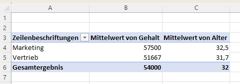

<br>

> Big Data ist alles, was nicht mehr in Excel passt.

Excel? Ernsthaft? Ja, wirklich. Zu den Hoch-Zeiten des Begriffs "Big Data" gab es mal diese ganz besondere Definition - für viele Data Scientists war Excel das Tool der Wahl für "kleinere Probleme". Für "große Probleme" gab es Hadoop. Und in der Tat: Excel ist ein vielseitiges Tool für Data Science-Analysen und bietet eine benutzerfreundliche Plattform für Einsteiger. Mit seiner tabellarischen Struktur können Daten effizient organisiert, analysiert und visualisiert werden. Excel ermöglicht grundlegende statistische Berechnungen, Datenmanipulation und die Erstellung einfacher Modelle. Für Anfänger bietet es einen zugänglichen Einstieg in Data Science, während es fortgeschrittenen Benutzern die Möglichkeit bietet, komplexe Analysen durchzuführen. Trotz seiner Limitationen im Vergleich zu speziellen Data Science-Tools bleibt Excel eine wertvolle Ressource für Datenanalysen und bietet eine solide Grundlage für den Einstieg in die Welt der Datenwissenschaft.

**Disclaimer:** Dies soll nicht als Microsoft-Werbung verstanden sein. Der Begriff *Excel* wird hier stellvertretend verwendet für beliebige Tabellenkalkulation. Die Lösungen von z.B. LibreOffice, OpenOffice oder auch Numbers verfügen über völlig analoge, gleichwertige Funktionalitäten.

## Excel für die Datenanalyse

Im folgenden sollen einige wichtige Excel-Funktionen aufgelistet werden, die ein Data Scientist kennen sollte:

**Achtung:** hier werden die englischen Namen der Funktionen verwendet. Je nach Anbieter und Sprachdatei Ihrer Installation werden die Funktionen einen anderen Namen haben - schlagen Sie dies ggf. mit einer kurzen Onlinesuche nach.
{: .notice--danger}

Angenommen, uns liegen folgende einfache Daten in Excel vor:

| Name    | Alter | Gehalt | Position      |
|---------|-------|--------|---------------|
| Anna    | 28    | 45000  | Entwickler    |
| Bob     | 35    | 60000  | Manager       |
| Clara   | 42    | 70000  | Projektleiter |
| David   | 30    | 55000  | Entwickler    |
| Emily   | 25    | 40000  | Assistent     |

Anhand dieses einfachen Datensatzes lässt sich eine Vielzahl an Excel-Funktionen demonstrieren.

### Einfache Statistik-Funktionen

#### SUM:

Die SUM-Funktion in Excel wird verwendet, um die Summe von Zahlen in einem Bereich zu berechnen.

Beispiel: 
```
=SUM(B2:B6)
```

Ergebnis: Summe der Gehälter von Zeile 2 bis Zeile 6.

#### MEAN

Die MEAN-Funktion berechnet den Durchschnitt der Zahlen in einem Bereich.

Beispiel: 
```
=MEAN(B2:B6)
```

Ergebnis: Durchschnittsalter der Personen in Zeile 2 bis Zeile 6.

#### COUNT

Die COUNT-Funktion zählt die Anzahl der Zellen in einem Bereich, die Zahlen enthalten.

Beispiel: 
```
=COUNT(B2:B6)
```
Ergebnis: Anzahl der Zahlen im Bereich B2:B6.

#### MAX und MIN:
MAX gibt den größten Wert in einem Bereich zurück, während MIN den kleinsten Wert zurückgibt.

Beispiel:
```
=MAX(B2:B6) 
```
gibt das Maximum der Zahlen im Bereich B2:B6 zurück.

```
=MIN(B2:B6)
```
gibt das Minimum der Zahlen im Bereich B2:B6 zurück.

####  STDEV und STDEVP:

STDEV berechnet die Standardabweichung einer Stichprobe, während STDEVP die Standardabweichung einer Population berechnet.

Beispiel:

```
=STDEV(B2:B6)
```
berechnet die Standardabweichung der Werte im Bereich B2:B6.

```
=STDEVP(B2:B6)
```
berechnet die Standardabweichung der Population der Werte im Bereich B2:B6.

Beim Unterschied zwischen STDEV und STEVP geht es  um eine robuste **Schätzung der Standardabweichung (bzw. Varianz) einer Stichprobe**. Die Statistik dahinter finden Sie [hier](https://en.wikipedia.org/wiki/Unbiased_estimation_of_standard_deviation).
**Kurz gesagt:** Nutzen Sie STDEV, wenn Ihre Werte nur eine Stichprobe (eine Teilmenge) der Gesamtheit aller möglichen Werte ist. Nutzen Sie STDEVP, wenn Ihre Werte alle nur denkbaren Ausprägungen umfasst. 
{: .notice--info} 


####  AVERAGEIF und AVERAGEIFS
AVERAGEIF berechnet den Durchschnitt einer Reihe von Zahlen, die bestimmte Kriterien erfüllen.
AVERAGEIFS berechnet den Durchschnitt einer Reihe von Zahlen, die mehrere Kriterien erfüllen.

Beispiel:
```
=AVERAGEIF(D2:D6, "Entwickler", B2:B6) 
```
gibt den Durchschnitt der Gehälter der Entwickler zurück.

```
=AVERAGEIFS(B2:B6, D2:D6, "Entwickler", C2:C6, ">30") 
```
gibt den Durchschnitt der Gehälter der Entwickler über 30 zurück.

Mit diesen Funktionen können Sie verschiedene statistische Analysen direkt in Excel durchführen, ohne auf komplexe Formeln zurückgreifen zu müssen. Experimentieren Sie mit ihnen, um Ihr Verständnis für die Datenanalyse zu vertiefen.

### Vergleiche und Verweise

Neben grundlegenden Statistik-Funktionen bietet Excel auch eine Reihe von Tricks zum Suchen und Manipulieren von Daten. Üblicherweise baut man die folgenden Funktionen zu komplexeren Formeln zusammen.

#### MATCH (VERGLEICH):
Die MATCH-Funktion sucht nach einem Wert in einem Bereich und gibt die Position dieses Werts zurück. 

Beispiel: 
```
=MATCH("Manager", D2:D6, 0)
```
Ergebnis: Die Position, an der "Manager" in der Spalte "Position" gefunden wird.

#### LOOKUP (SVERWEIS):
LOOKUP durchsucht einen Wert in einem Bereich und gibt den entsprechenden Wert in einer anderen Zeile oder Spalte zurück.

Beispiel: 
```
=LOOKUP("David", A2:A6, C2:C6)
```
Ergebnis: Das Gehalt von David, basierend auf seinem Namen.

#### INDEX:

INDEX gibt den Wert einer Zelle in einem bestimmten Bereich basierend auf der Zeilen- und Spaltennummer zurück.
```
Beispiel: =INDEX(C2:C6, 3)
```
Ergebnis: Das Gehalt der dritten Person in der Liste.

####  VLOOKUP und HLOOKUP (SVERWEIS und HVERWEIS):
VLOOKUP sucht in der ersten Spalte einer Tabelle nach einem Wert und gibt einen Wert in derselben Zeile aus einer Spalte, die Sie angeben, zurück. HLOOKUP funktioniert ähnlich, sucht jedoch horizontal.

Beispiel:
```
=VLOOKUP("Anna", A2:D6, 3, FALSE) 
```
gibt das Gehalt von Anna zurück, basierend auf ihrem Namen.

```
=HLOOKUP("Gehalt", A1:D6, 3, FALSE) 
```

gibt das Gehalt von einer Spalte zurück, basierend auf der Überschrift "Gehalt".

#### CONCATENATE oder &

Diese Funktionen werden verwendet, um Zeichenketten zusammenzufügen.

Beispiel:
```
=CONCATENATE(A2, " ist ", B2, " Jahre alt.")
```
 oder 
 ```
 =A2 & " ist " & B2 & " Jahre alt."
 ```
 gibt einen Satz mit dem Namen und dem Alter der Person zurück.

#### COUNTIF und COUNTIFS

COUNTIF zählt die Anzahl der Zellen in einem Bereich, die bestimmte Kriterien erfüllen. COUNTIFS funktioniert ähnlich, jedoch können mehrere Kriterien angegeben werden.

Beispiel:
```
=COUNTIF(D2:D6, "Entwickler")
```

zählt die Anzahl der Entwickler.
```
=COUNTIFS(D2:D6, "Entwickler", B2:B6, ">30")
```
zählt die Anzahl der Entwickler über 30 Jahre alt.

Diese Funktionen sind äußerst nützlich für die Datenanalyse in Excel und können Ihnen dabei helfen, Daten zu filtern, zu analysieren und zu präsentieren. Experimentieren Sie mit ihnen, um Ihr Verständnis für Excel-Funktionen zu vertiefen.

## Pivottabellen



Pivottabellen sind ein leistungsstarkes Werkzeug in Excel, um sehr schnell große Datenmengen zu analysieren und zu summarisieren. Sie ermöglichen es, Daten aus verschiedenen Blickwinkeln zu betrachten, indem sie es dem Benutzer erlauben, Daten mit wenigen Mausklickks zu gruppieren, zu filtern, zu sortieren und zu berechnen. Die Verwendung benötigt allerdings etwas Übung.

Gegeben sei erneut ein einfacher Datensatz. 

| Name    | Abteilung | Gehalt | Alter |
|---------|-----------|--------|-------|
| Anna    | Vertrieb   | 45000  | 28    |
| Bob     | Marketing | 60000  | 35    |
| Clara   | Vertrieb   | 70000  | 42    |
| David   | Marketing | 55000  | 30    |
| Emily   | Vertrieb   | 40000  | 25    |

Wir möchten ein paar grundlegende Eigenschaften der Daten bestimmen.

1. Kopieren Sie die Daten nach Excel. Wählen Sie den Bereich Ihrer Daten aus. Klicken Sie auf eine Zelle in Ihrem Datensatz
2. Gehen Sie zum Menüband und wählen Sie die Registerkarte "Einfügen".
3. Klicken Sie auf die Schaltfläche "Pivottabelle" in der Gruppe "Tabellen".
4. Im Dialogfeld "Pivottabelle erstellen" wird der Bereich Ihrer Daten automatisch ausgewählt. Bestätigen Sie dies und klicken Sie auf "OK".
5. Ein neues Arbeitsblatt wird geöffnet, und auf der rechten Seite erscheint das "Pivottabellenfelder"-Fenster.
6. Ziehen Sie die Felder aus Ihrem Datensatz in die verschiedenen Abschnitte des "Pivottabellenfelder"-Fensters:
Ziehen Sie Felder in den Abschnitt "Zeilen", um eine Dimension hinzuzufügen (z. B. "Abteilung").
Ziehen Sie Felder in den Abschnitt "Werte", um Werte zu aggregieren (z. B. "Gehalt").
Ziehen Sie Felder in den Abschnitt "Spalten", um eine weitere Dimension hinzuzufügen (z. B. "Alter").

Die Pivottabelle wird automatisch erstellt, um die aggregierten Daten gemäß Ihrer Auswahl darzustellen.

**Achtung:** wenn sich Ihre Original-Daten ändern, müssen Sie die Pivottabelle manuell aktualisieren.
{: .notice--danger}


Verwenden Sie die Filter- und Sortieroptionen, um die Daten weiter zu analysieren und anzupassen. Durch das Experimentieren mit den verschiedenen Feldern und Optionen können Sie die Pivottabelle an Ihre Analyseanforderungen anpassen und detaillierte Einblicke in Ihre Daten erhalten.


