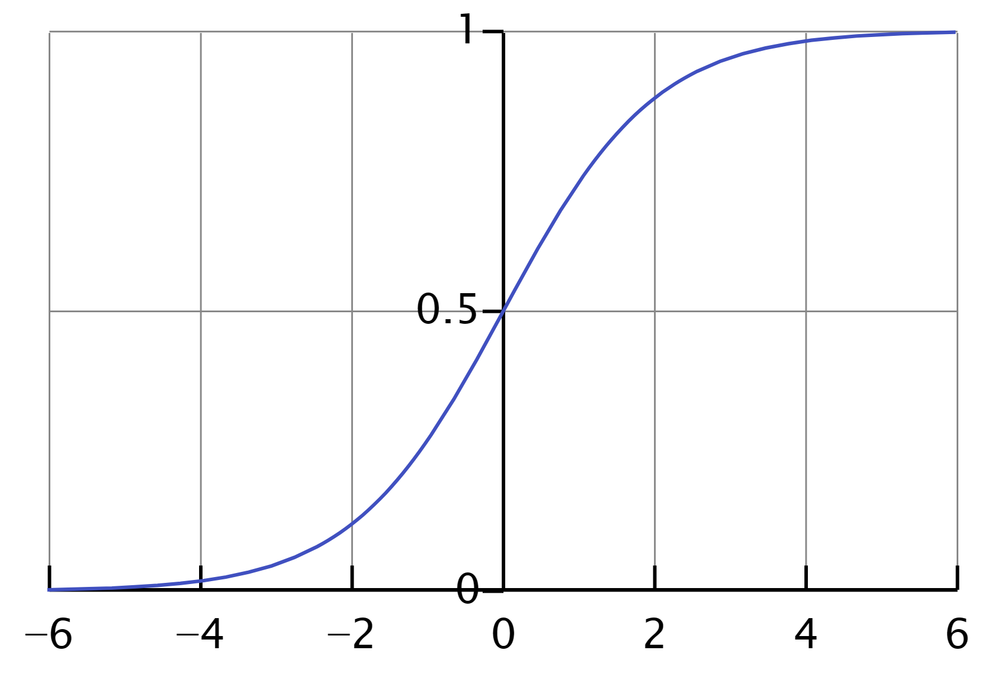

## Lineare Zusammenhänge

In vergangenen Modulen haben wir uns bereits mit der Korrelation zwischen Merkmalen in Daten beschäftigt. Ganz intuitiv wissen wir, dass zwischen Variablen eine lineare Abhängigkeit bestehen kann. 

Aus der Schule sind uns lineare Abhängigkeiten bekannt über die Gleichung
$$
y=ax+b
$$
für den eindimensionalen Merkmalsraum, oder
$$
y=\beta_1 x_1 + \beta_2 x_2 + \ldots + \beta_n x_n + \beta_0
$$
oder, in Vektor-Schreibweise:
$$
y=X\beta
$$
für den $n$-dimensionalen Merkmalsraum (das $\beta_0$ lösen wir durch ein zusätzliches Dummy-Merkmal mit konstantem Wert 1).

Ein typisches praktisches Beispiel ist der Zusammenhang zwischen _Größe_ und _Gewicht_ von Dingen oder Personen. In der Grafik sehen wir das Ergebnis einer Datenerhebung, die klar einen linearen Zusammenhang erkennen lässt:


Aber wie finden wir die konkreten Gewichte dieses Zusammenhangs? Welche Linie beschreibt die Daten am besten (in der Sprache des maschinellen Lernens formuliert: welches Modell hat die Maximum Likelihood in Anbedtract unseres Datensatzes?).

Intutiv sehen wir, dass die im Beispiel unten die blaue Linie besser zu den Daten passt als die rote:


Mathematisch formuliert ist dies klar, weil die blaue Linie, ausgedrückt durch einen Parametervektor $\beta$, die Abweichung der einzelnen Datenpunkte zur Projektion auf der Linie minimiert:
$$
\min_\beta ||X\beta-y||^2_2
$$

Das $\beta$, das diese Funktion minimiert, lässt sich analytisch bestimmen, die Methode dazu bezeichnet man als Ordinary Least Squares. Die Implementierung zum Finden eines Modells, dass diese Linie (bzw. Hyperebene) beschreibt, bezeichnet man als **Lineare Regression**.

Der Code, um eine solche Regression umzusetzen, ist denkbar einfach:

```python
import numpy as np
from sklearn.linear_model import LinearRegression

# Example data
X = np.array([[1, 1], [1, 2], [2, 2], [2, 3]])
# y = 1 * x_0 + 2 * x_1 + 3
y = np.dot(X, np.array([1, 2])) + 3

# Fit the model
reg = LinearRegression().fit(X, y)

# Model evaluation
score = reg.score(X, y)
coefficients = reg.coef_
intercept = reg.intercept_

print(f"R-squared score: {score:.2f}")
print(f"Coefficients: {coefficients}")
print(f"Intercept: {intercept:.2f}")
print(f"Predicted value for new data: {predicted_value[0]:.2f}")
```

## Anwendungen linearer Regression

Aber warum sollte man sich überhaupt für die genaue Bestimmung eines linearen Zusammenhangs interessieren? Ein wichtiger Aspekt ist die Anwendung des Modells als Vorhersage. In unserem konkreten Beispiel könnten wir unser gelerntes Modell verwenden, um die Zielvariable $y$ bei neuen, bisher unbekannten Eingabedaten $X$ vorherzusagen:

```python
new_data = np.array([[3, 5]])
predicted_value = reg.predict(new_data)
print(f"Predicted value for new data: {predicted_value[0]:.2f}")
```


**Aufgabe:** Schauen Sie sich das [vollständige Beispiel zur Anwendung linearer Regression](
https://scikit-learn.org/stable/auto_examples/linear_model/plot_ols.html#sphx-glr-auto-examples-linear-model-plot-ols-py) in der Dokumentation von Scikit Learn an.
{: .notice--warning} 

Diese Vorhersage-Funktion ist unglaublich mächtig! Lineare Regressionsmodelle haben zahlreiche praktische Anwendungen. Das Prinzip ist immer das gleiche: aus einem bekannten historischen Datensatz (z.B. zu Maschinendaten, Preisdaten, Wetterdatten) wird ein Modell gelernt. Im Anschluss wird das Modell im Alltag verwendet, um für neue Szenarien das wahrscheinlichste Ergebnis vorherzusagen.

## Ausbaustufen

Lineare Regression mit Ordinary Least Squares ist nur die allereinfachste Form der Regression. Es gibt unzählige Ausbaustufen. Tatsächlich kann man sogar ein komplexes Neuronales Netz als Sonderform der Regression interpretieren.

**Aufgabe:** Machen Sie sich in der [Dokumentation von Scikit Learn](https://scikit-learn.org/stable/modules/linear_model.html#ordinary-least-squares) mit Ausbaustufen der Linearen Regression vertraut, insebsondere mit Ridge und Lasso Regression. Wir werden in der Vorlesung noch einmal über den Sinn und Zweck dieser Varianten sprechen.
{: .notice--warning} 

Neben technischen Erweiterungen der Regression gibt es auch "fachlich-mathematische". Statt linearen Zusammenhängen kann man das Regressionsmodell auch leicht anpassen, um polynomielle Zusammenhänge zu modellieren.

**Aufgabe:** Machen Sie sich in der [Dokumentation von Scikit Learn](https://scikit-learn.org/stable/modules/linear_model.html#polynomial-regression-extending-linear-models-with-basis-functions) damit vertraut, wie man das Basismodell der linearen Regresssion um eine polynomielle Abhängifkeit erweitern kann.
{: .notice--warning} 

## Logistische Regression

Auch die Logistische Regression sagt eine Zielvariable $y$ aus einem Vektor an Eingabemerkmalen $x$ voraus. Allerdings ist der Zusammenhang nicht linear, sondern folgt einer speziellen Sigmoid-Funktion:
$$
y = \frac{1}{1+e^{-\beta x}}
$$
Auch hier gibt es (etwas anspruchsvollere) mathematische Verfahren, die das beste $\beta$ finden, das für einen gegebenen Datensatz $X$ die vorgegebenen  Zielvariablen $y$ mit dem geringsten Fehler vorhersagen kann. 

Besonderes Merkmal der logistischen Funktion ist aber insbesondere, dass ihr Ergebnis ($y$) immer nahe an -1 oder 1 ist. Das erkennt man leicht an ihrer Form:



Der Algorithmus wird deshalb trotz seines Namens üblicherweise nicht als Verfahren zur _Regression_ (Vorhersage von kontinuierlichen Zahlenwerten), sondern als Verfahren zur _Klassifikation_ (Vorhersage von Kategorien) verwendet.

Der Code spiegelt das ebenfalls wieder:

```python
import numpy as np
from sklearn.linear_model import LogisticRegression
from sklearn.datasets import make_classification

# Erzeugen Sie ein einfaches Klassifikationsproblem
X, y = make_classification(n_samples=100, n_features=2, n_informative=2, n_redundant=0, random_state=42)

# Erstellen Sie das Modell
model = LogisticRegression()

# Trainieren Sie das Modell
model.fit(X, y)

# Vorhersagen treffen
new_data = np.array([[0.5, 0.5]])
predicted_class = model.predict(new_data)

print(f"Vorhergesagte Klasse für neue Daten: {predicted_class[0]}")
```

**Aufgabe:** Werfen Sie in der  [Dokumentation von Scikit Learn](https://scikit-learn.org/stable/modules/linear_model.html#logistic-regression) auf die Grundzügen der logistischen Regression.
{: .notice--warning} 