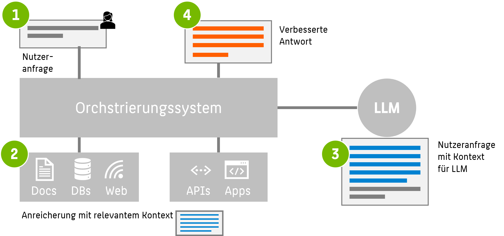

Vektordatenbanken spielen schon seit langer Zeit in der Geoinformationstechnologie eine große Rolle. Im Gegensatz zu herkömmlichen relationalen Datenbanken setzen Vektordatenbanken auf die Speicherung in Form von Vektoren, die Punkte, Linien oder Polygone repräsentieren. Dies ermöglicht eine präzise Modellierung und Analyse räumlicher Informationen. Durch die Kombination von KI-Algorithmen mit (Echtzeit-)Geoinformationen sind in der Vergangenheit innovative standortbasierten Dienste, Navigationssysteme und städtische Planungslösungen entstanden.

Besondere Aufmerksamkeit haben Vektordatenbanken auch mit dem Aufkommen von ChatGPT & Co erlangt. Large Language Models haben zahlreiche neue und aufregende Anwendungen ermöglicht.Ene bekannte Einschränkung von ChatGPT ist, dass ein trainiertes Sprachmodell keine Kenntnisse über aktuelle Ereignisse hat und keine Informationen aus Dokumenten besitzt, auf denen es nicht trainiert wurde. Um dieses Problem zu bewältigen, kommt die Methode der **Retrieval Augmented Generation**  (RAG) zum Einsatz, für die Vektordatenbanken unerlässlich sind. 

## Vector Embeddings mit neuronalen Netzen

Um alltägliche Daten als Vektoren abzubilden, werden verschiedene Methoden genutzt. Im folgenden Beispiel nutzen wir einen Autoencoder, um Bilddaten erst auf eine niedrig-dimensionalere Repräsentation abzubilden (Encoder) und dann (fehlerbehaftet) die Originaldaten wieder herzustellen. Nachdem das neuronale Netz wiederholt trainiert wurde, so dass der Rekonstruktionsfehler minimiert wurde, kann der innere *Latent Space* als niedrigdimensionaleres Embedding der Originaldaten verstanden werden. Der Encoder ist also unser *Vecotrizer*, der Latent Space unser Ziel-Vektorraum, und der Decoder die Rückübersetzung in den Bildraum.

*Autoencoder (schematischer Aufbau)*

[Dieser Code](https://databasecamp.de/ki/autoencoder) zeigt exemplarisch, wie man einen Autoencoder für MNIST-Daten trainieren kann. Es fällt insbesondere auf, dass ähnliche Bilder (z.B. Bilder der handschriftlichen Zahl "0") auf ähnliche (nahe) Vektoren im Latent Space abgebildet werden. Dieses Prinzip lässt sich insbesondere mit Bilddaten, aber auch mit allen numerischen Eingabedaten fester Größe verwenden. Text-Eingaben, wie sie bei LLMs verwendet werden, zeichnen sich insbesondere durch ihre dynamsische Länge aus, deshalb wird das Prinzip des Autoencoders abgewandelt. Ein wichtiger Ansatz dafür ist word2vec, den wir an anderer Stelle erklären.

@Todo
<!-- 
How TO Word2Vec
https://www.tensorflow.org/text/tutorials/word2vec
-->

## Semantische Suche: k-Nearest Neighbor im Latent Space

Ein erster Anwendungsfall von vektorisierter Datenrepräsenation liegt nahe. Stellen Sie sich eine Wissensbasis vor (z.B. Website, Sharepoint, Dokumentensammlung), die mit Hilfe eines Autoencoders als Menge von Vektoren abgelegt wurde. Wir können nun mit einer Anfrage (Query) in natürlicher Sprache in dieser "Datenbank" suchen, indem wir unseren Query als Vektor darstellen und die $k$ nächsten (ähnlichsten) Dokumentvektoren als Ergebnis der Suche ausgeben. Dazu berechnen wir die Distanzen des Vektors zu allen Einträgen (= Vektoren = Punkten) in der Datenbank und geben die *k-Nearest-Neighbors* aus.

*Semantische Suche: Distanzen vom Query zu allen Vektoren in der Datenbank)*

## Approximate $k$NN: Vektordatenbanken

Leider sinkt die Performance einer brute force Suche stark sowohl mit der Dimension des Latent Spaces als auch der Größe der Datenbank.  

@Todo: 
Übungsaufgabe: Was ist die Komplexitätsklasse einer brute force Semantischen Suche eines $k$-Nearest-Neighbor-Algorithmus mit Euklidscher Distanz in einem D-dimensionalen Vektorraum mit N bestehenden Vektoren? 

<!-- 
Die Komplexitätsklasse einer brute force Suche eines k-Nearest-Neighbor-Algorithmus mit Euklidscher Distanz in einem D-dimensionalen Vektorraum mit N bestehenden Vektoren ist O(ND)1. Das bedeutet, dass die Laufzeit des Algorithmus proportional zur Anzahl der Dimensionen D und zur Anzahl der Vektoren N ist. Um die Klassifizierung eines neuen Punkts zu bestimmen, muss der Algorithmus die euklidische Distanz zwischen diesem Punkt und allen anderen Punkten im Datensatz berechnen2. Dies erfordert D Multiplikationen und D-1 Additionen für jeden Punkt, also insgesamt ND Multiplikationen und N(D-1) Additionen. Die Komplexität hängt also nur von N und D ab, nicht von k3.
-->

Zum Glück existiert eine Reihe von Approximationsalgorithmen, die das Ergebnis deutlich beschleunigen, zum Beispiel
* Navigable Small World Search
* Hierarchical Navigable Small World (HNSW) Search
welche eine Laufzeit von nur $O(\log N)$ aufweisen.

Diese Approximationsalgorithmen legen zusätzliche Metadaten im Vektorraum an, die die Suche beschleunigen. Diese Vorgehensweise macht den Kern von *Vektordatenbanken* aus, welche Sammlungen von Vektoren verwalten und schnell durchsuchbar machen.

Das beigefügte Jupyter Notebook (abgewandelt vom Original-Kurs, siehe Quellenangaben) zeigt, wie man eine Vektordatenbank mit Daten füllt und einen Query gegen die Datenbank laufen lässt.

@todo
<!-- 
https://learn.deeplearning.ai/vector-databases-embeddings-applications/lesson/4/approximate-nearest-neighbours
-->

## Retrieval Augmented Generation

Retrieval Augmented Generation (RAG) beschreibt den Ansatz, zusätzliches Wissen in einer Vektor-Datenbank als externe Knowledge Base für einen Query an ein Large Language Model zu verwenden. Die Vorteile sind vielfältig:
* das LLM erhält zusätzliche (aktuelle) Fakten für die Formulierung seiner Antworten
* Prompts an das LLM können mit zusätzlichen Informationen ausgestattet werden 
* spart Re-Training oder Finetuning des LLMs
* reduziert Halluzinationen
* ermöglicht dem LLM das Nennen von Quellen

Die folgende Grafik illustriert den Ablauf einer LLM-Anfrage mit RAG:

1. Ein Nutzer formuliert eine Anfrage.
2. Das System sucht in einer Knowledge Base (Vektordatenbank, aber auch externe Quellen) nach relevanten Dokumenten zur Anfrage.
3. Diese Dokumente werden (vektorisiert) der Anfrage an das LLM beigefügt.
4. Das LLM hat mehr Kontext für seine Anfrage und kann so eine qualitativ hochwertigere Antwort geben.

*RAG: schematischer Ablauf*

[Dieser Code](https://learn.deeplearning.ai/vector-databases-embeddings-applications/lesson/7/application---multilingual-search) zeigt zwei naheliegende Anwendungen des RAG-Prinzips:
1. Iteratives single prompting: Beauftrage wiederholt das LLM für jedes einzelne Dokument im Kontext: *Hallo ChatGPT, schreibe mir einen facebook post über {title} mit Informationen über {content}*.
2. Gruppen-Prompt: *Hallo ChatGPT, erstelle mir eine Zusammenfassung*

## Weiterführende Infos und Selbststudium 

## ⚑ Quellenangaben

Dieses Modul wurde auf Basis des Kurses *Vector Databases: from Embeddings to Applications* von Andrew Ng (DeepLearning.AI) und Sebastian Witalec (Weaviate) erstellt. [Zum Kurs](https://www.deeplearning.ai/short-courses/vector-databases-embeddings-applications)
{: .notice--info}

[^1]: Tomas Mikolov, Ilya Sutskever, Kai Chen, Grec Corrado, Jeffrey Dean: [Distributed Representations of Words and Phrases and their Compositionality.](https://papers.nips.cc/paper/2013/file/9aa42b31882ec039965f3c4923ce901b-Paper.pdf)

