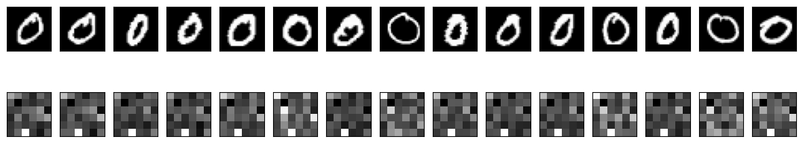
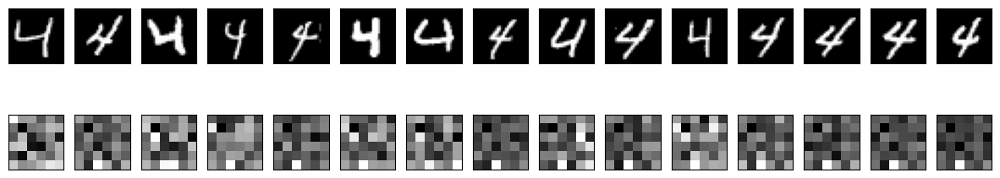
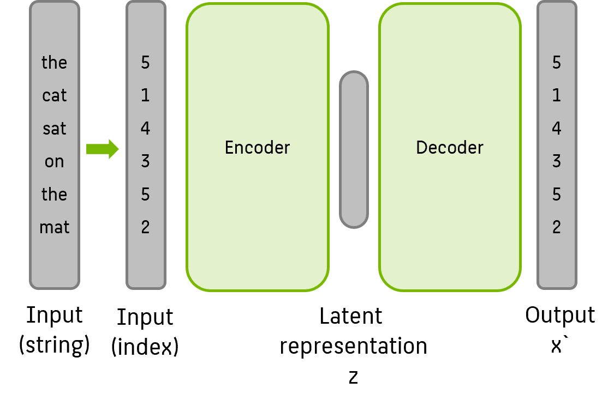
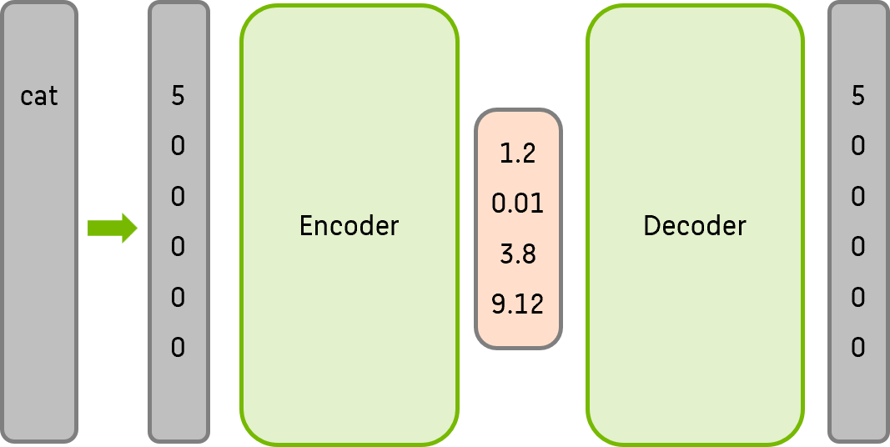
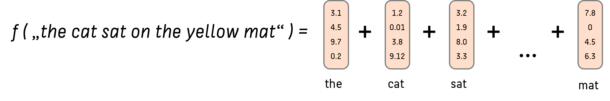
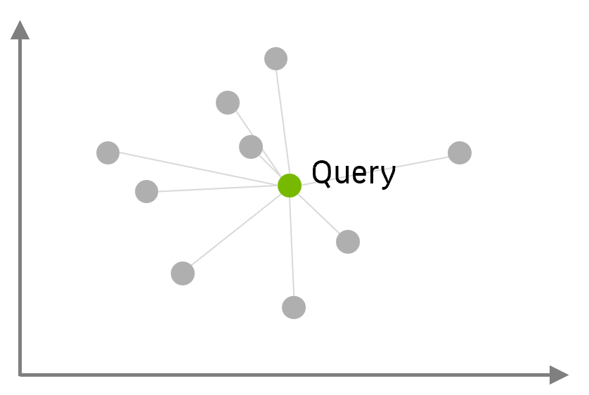

Vektordatenbanken spielen schon seit langer Zeit in der Geoinformationstechnologie eine große Rolle. Im Gegensatz zu herkömmlichen relationalen Datenbanken setzen Vektordatenbanken auf die Speicherung in Form von Vektoren, die Punkte, Linien oder Polygone repräsentieren. Dies ermöglicht eine präzise Modellierung und Analyse räumlicher Informationen. Durch die Kombination von KI-Algorithmen mit (Echtzeit-)Geoinformationen sind in der Vergangenheit innovative standortbasierten Dienste, Navigationssysteme und städtische Planungslösungen entstanden.

Besondere Aufmerksamkeit haben Vektordatenbanken auch mit dem Aufkommen von ChatGPT & Co erlangt. Large Language Models haben zahlreiche neue und aufregende Anwendungen ermöglicht.Ene bekannte Einschränkung von ChatGPT ist, dass ein trainiertes Sprachmodell keine Kenntnisse über aktuelle Ereignisse hat und keine Informationen aus Dokumenten besitzt, auf denen es nicht trainiert wurde. Um dieses Problem zu bewältigen, kommt die Methode der **Retrieval Augmented Generation**  (RAG) zum Einsatz, für die Vektordatenbanken unerlässlich sind. 

## Vector Embeddings mit neuronalen Netzen

Um alltägliche Daten als Vektoren abzubilden, werden verschiedene Methoden genutzt. [Dieser Code](/modules/autoencoder/MNIST_Autoencoder.ipynb) zeigt exemplarisch, wie man einen **Autoencoder** für [MNIST](https://en.wikipedia.org/wiki/MNIST_database)-Daten trainieren kann. Hier nutzen wir einen Autoencoder, um Bilddaten erst auf eine niedrig-dimensionalere Repräsentation abzubilden (Encoder) und dann (fehlerbehaftet) die Originaldaten wieder herzustellen. Nachdem das neuronale Netz wiederholt trainiert wurde, so dass der Rekonstruktionsfehler minimiert wurde, kann der innere *Latent Space* als niedrigdimensionaleres **Embedding** der Originaldaten verstanden werden. Der Encoder ist also unser *Vectorizer*, der Latent Space unser Ziel-Vektorraum, und der Decoder die Rückübersetzung in den Bildraum.

Bei genauerer Betrachtung des Jupyter Notebooks fällt insbesondere auf, dass ähnliche Bilder (z.B. alle Bilder der handschriftlichen Zahl "0") auf ähnliche (nahe) Vektoren im Latent Space abgebildet werden:

"Nullen" im latent space:

Im Vergleich dazu "Vieren" im latent space:

Eine detaillierte Erklärung zum Thema Autoencoder finden Sie in [der zugehörigen Lektion](/modules/autoencoder/autoencoder.md). 
{: .notice--info} 

Das heißt, dass sich semantisch-inhaltliche Daten auch an einem ähnlichen Ort im Latent Space befinden.

# Vector Embeddings für Texte.

Das Prinzip des Embeddings unter Beibehaltung der semantischen Nähe lässt sich mit Bilddaten, aber auch mit allen anderen numerischen Eingabedaten fester Größe verwenden. Aber was ist mit natürlicher Sprache? Text-Eingaben, wie sie bei LLMs verwendet werden, zeichnen sich insbesondere durch ihre dynamische Länge aus, deshalb muss dazu das Prinzip abgewandelt werden. 

[Dieses Tutorial zu **Word embeddings**](https://www.tensorflow.org/text/tutorials/word_embeddings) erklärt detailliert, wie man ein neuronales Netz trainiert, welches aus Texten (also Strings, als Input) einen Latent Space lernt, der für jedes Wort einen Vektor als numerische Repräsentation angibt. Hier vermitteln wir nur eine grundlegende Intuition:

 

Vereinfacht gesagt werden zum Training Textsequenzen fester Länge (also z.B. immer 10 Worte, oder, wie im Beispiel oben, immer 6 Worte) zuerst in numerische Vektoren umgewandelt, indem die Worte durch ihren Index im Vokabular ersetzt werden. Nach dem bekannten Prinzip des Autoencoders wird nun eine *latent representation* gelernt.

Dieses Verfahren führt nach dem Training insbesondere auch dazu, dass auch einzelne Worte eine latente Repräsentation haben:

 

Ein derartiges Verfahren führt auch dazu, dass semantisch ähnliche Worte wie z.B. *Katze* und *Kater* deutlich näher beieinander im Latent Space platziert sind als semantisch verschiedene Worte wie *Katze* und *Finanzamt*. 

Probieren Sie es selbst aus: der [Tensorflow Embedding Projector](https://projector.tensorflow.org/) erlaubt das interaktive Spielen mit derartigen bestehenden Embeddings.

Um im praktischen Einsatz dann ganze Sätze (oder Dokumente! oder Dokumentensammlungen!) dynamischer Länge als Embedding zu repräsentieren, gibt es sehr unterschiedliche Ansätze. Der einfachste ist vermutlich **Pooling**: die Wort-Vektoren aller Worte im Satz werden einfach aufaddiert (und ggf. normiert):

 

Intuitiv wird damit klar, dass auch Sätze (und Dokumente), die sich semantisch ähneln, nahe im Latent Space beieinander gruppiert werden, während Sätze (und Dokumente) mit stark unterschiedlichem Inhalt eine hohe euklidsche Distanz aufweisen.

## Semantische Suche: k-Nearest Neighbor im Latent Space

 

Ein Anwendungsfall dieser vektorisierten Datenrepräsenation liegt damit extrem nahe: stellen Sie sich eine Wissensbasis vor (z.B. Website, Sharepoint, Dokumentensammlung), die mit Hilfe eines Autoencoders als Menge von Vektoren abgelegt wurde. Wir können nun mit einer Anfrage (Query) in natürlicher Sprache in dieser "Datenbank" suchen, indem wir unseren Query als Vektor darstellen und die $k$ nächsten (ähnlichsten) Dokumentvektoren als Ergebnis der Suche ausgeben. Dazu berechnen wir die Distanzen des Vektors zu allen Einträgen (= Vektoren = Punkten) in der Datenbank und geben die nächsten k Nachbarn im Raum aus. Damit haben wir eine Dokumentensuche implementiert, die nicht rein auf Schlagworten basiert, sondern echte sprachlich-semantische Ähnlichkeiten beachtet.

## Approximate $k$NN: Vektordatenbanken

Effiziente Algorithmen für *k-Nearest-Neighbors* sind seit langem Gegenstand der Forschung. Leider sinkt die Performance einer brute force Suche stark sowohl mit der Dimension des Latent Spaces als auch der Größe der Datenbank.  

*Überlegen Sie mal*: Was ist die Komplexitätsklasse einer brute force Semantischen Suche eines $k$-Nearest-Neighbor-Algorithmus mit Euklidscher Distanz in einem D-dimensionalen Vektorraum mit N bestehenden Vektoren? {: .notice--warning} 

<!-- 
Die Komplexitätsklasse einer brute force Suche eines k-Nearest-Neighbor-Algorithmus mit Euklidscher Distanz in einem D-dimensionalen Vektorraum mit N bestehenden Vektoren ist O(ND)1. Das bedeutet, dass die Laufzeit des Algorithmus proportional zur Anzahl der Dimensionen D und zur Anzahl der Vektoren N ist. Um die Klassifizierung eines neuen Punkts zu bestimmen, muss der Algorithmus die euklidische Distanz zwischen diesem Punkt und allen anderen Punkten im Datensatz berechnen2. Dies erfordert D Multiplikationen und D-1 Additionen für jeden Punkt, also insgesamt ND Multiplikationen und N(D-1) Additionen. Die Komplexität hängt also nur von N und D ab, nicht von k3.
-->

Zum Glück existiert eine Reihe von Approximationsalgorithmen, die das Ergebnis deutlich beschleunigen, zum Beispiel
* Navigable Small World Search
* Hierarchical Navigable Small World (HNSW) Search
welche eine Laufzeit von nur $O(\log N)$ aufweisen.

Diese Approximationsalgorithmen legen zusätzliche Metadaten im Vektorraum an, die die Suche beschleunigen. Diese Vorgehensweise macht den Kern von *Vektordatenbanken* aus, welche Sammlungen von Vektoren verwalten und schnell durchsuchbar machen.

Dieses [beigefügte Jupyter Notebook]("/modules/vector-databases/vector_database.ipynb") (siehe Quellenangaben im Notebook) zeigt, wie man eine Vektordatenbank mit Daten füllt und einen Query gegen die Datenbank laufen lässt.

**Aufgabe:**  Studieren Sie das Jupyter Notebook und machen Sie sich mit der grundsätzlichen Funktionsweise einer Vektordatenbank vertraut. {: .notice--warning} 

**Anmerkung:**  Leider ist der zugrundeliegende Client für die Vektordatenbank nicht Windows-kompatibel, sie sollten also auf ein Linux-basiertes System wechseln oder WSL nutzen. Falls Sie WSL nutzen, möchten Sie dort vielleicht vorher auch [Anaconda installieren](https://gist.github.com/kauffmanes/5e74916617f9993bc3479f401dfec7da). {: .notice--info} 

**Anmerkung 2:**  Falls Sie gute Erfahrungen mit konkreten Anbietern von Vektordatenbanken gemacht haben - teilen Sie Ihr Wissen gern! {: .notice--info} 

## ⚑ Quellenangaben

Dieses Modul wurde in Teilen auf Basis des Kurses *Vector Databases: from Embeddings to Applications* von Andrew Ng (DeepLearning.AI) und Sebastian Witalec (Weaviate) erstellt. [Zum Kurs](https://www.deeplearning.ai/short-courses/vector-databases-embeddings-applications)
{: .notice--info}

[^1]: Tomas Mikolov, Ilya Sutskever, Kai Chen, Grec Corrado, Jeffrey Dean: [Distributed Representations of Words and Phrases and their Compositionality.](https://papers.nips.cc/paper/2013/file/9aa42b31882ec039965f3c4923ce901b-Paper.pdf)

