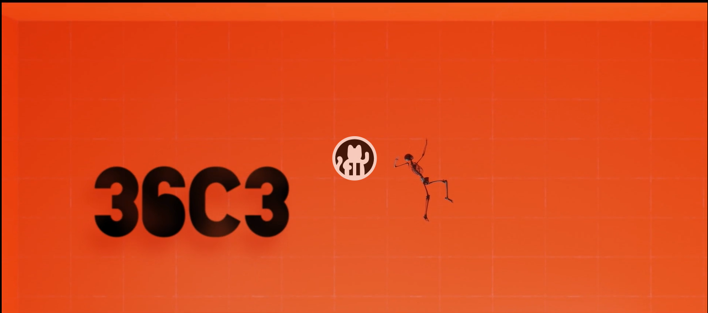

### 🕮 Vor der Vorlesung: Von den Besten lernen

Data Science ist Handwerkskunst! Ein exzellent gemachtes Beispiel für Data Science in der Praxis ist der Vortrag von [David Kriesel](https://www.dkriesel.com/start) zum Thema ["BahnMining - Pünktlichkeit ist eine Zier"](https://media.ccc.de/v/36c3-10652-bahnmining_-_punktlichkeit_ist_eine_zier) beim 36C3 des [Chaos Computer Clubs](https://www.ccc.de/).

Im Vortrag untersucht der Autor detailliert die Verspätungsdaten der Deutschen Bahn und leitet daraus "Praxistipps" für Jedermann ab. Der Vortrag ist in jeder Hinsicht sehr zu empfehlen als Vorbild für eine gut gemachte Analyse.