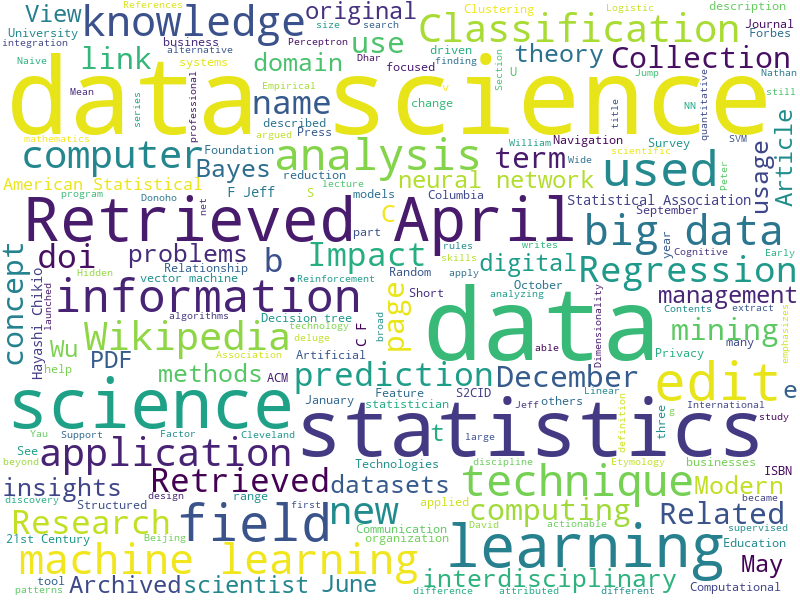

Im diesem Workshop machen wir erste Gehversuche mit Python, spielen mit der Technik und diskutieren ethische Fragestellungen.
{: .notice--primary} 

### 🚀 Challenge #1: Jupyter beherrschen

**Aufgabe:** Laden Sie sich  [`notebook.ipynb`](notebook.ipynb ':ignore') herunter, öffnen Sie das Notebook auf Ihrem Rechner und studieren Sie den Code.  Nutzen Sie die Anweisungen im Notebook, um eine Word Cloud wie im folgenden Bild zu erstellen. Verwenden Sie als Eingabe die Wikipedia-Artikel zu <em>Big Data</em> und <em>Machine Learning</em>.
{: .notice--warning} 

### 🚀 Challenge #2: DSGVO

Die Europäische Datenschutzgrundverordnung (DSGVO, engl. _General Data Protection Regulation_, GDPR) ist eine der einflussreichsten Datenschutz-Regulierungsmaßnahmen weltweit. Unter anderem definiert sie acht zentrale Rechte zum Schutz der Privatsphäre von Bürgern. 

**Aufgabe:** Studieren Sie die [DSGVO im Originaltext](https://dsgvo-gesetz.de/) bis inkl. Kapitel 3 und verfassen Sie im Miro eine Zusammenfassung der wesentlichen Aussagen (maximal 500 Wörter).
{: .notice--warning} 

### 🚀 Challenge #3: Case Study / Ethische Bewertung

In den Unterlagen zum Kurs haben Sie Ethics Challenges und Case Studies kennengelernt. Finden und untersuchen Sie nun Ihre eigene Case Study. Studieren Sie erneut die Beispiele oder holen Sie sich bei ChatGPT oder im Web eine Inspiration. Erstellen Sie eine Bewertung des Challenges und überlegen Sie: wie sind die Analysten vorgegangen / wie müsste man idealerweise vorgehen? 

**Aufgabe:** Sammeln Sie einige Nachrichten, wissenschaftliche Studien, Blog-Artikel oder andere Qellen, die Ihre ausgewählte Case Study als real vorgekommenes Geschehen zu belegen. Beschreiben Sie alle ethischen Fragen, unvorhergesehene Konsequenzen oder Gefahren, die im Zusammenhang vorkamen. Wenn möglich, nennen Sie Lösungsvorschläge, wie die Probleme hätten vermieden werden können. Nutzen Sie die [Deon Checklist](https://deon.drivendata.org/examples/) als Inspiration und Checkliste für Ihre ethische Bewertung.
{: .notice--warning} 

### 🚀 Challenge #4: Artifical General Intelligence

Hier gibt es kein Richtig oder Falsch, nur "sauberes" Arbeiten: 

**Aufgabe:** Recherchieren und diskutieren Sie und kommen Sie zu einem gemeinsamen Statement: was ist der "State-Of-The-Art" im Bereich Artificial General Intelligence?. 
{: .notice--warning} 

Wichtig: geben Sie für jede Frage an, auf welchen Quellen Sie Ihre Aussagen basieren, und warum Sie ausgerechnet diese Quellen verwenden. Formulieren Sie ein etwa 5-minütiges Statement als Vortrag. Folgende Fragen helfen Ihnen vielleicht, Ihre Aussagen zu strukturieren:
- Wie ist Artificial General Intelligence (AGI)? 
- Existiert AGI bereits? Wird AGI bald existieren? Wann?
- Welche Szenarien sind realistisch, wenn/falls AGI entsteht?