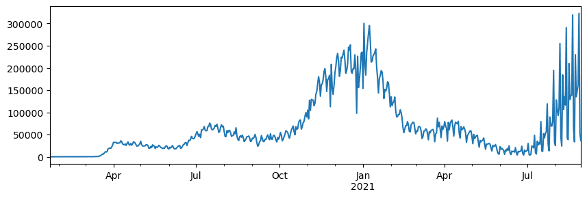
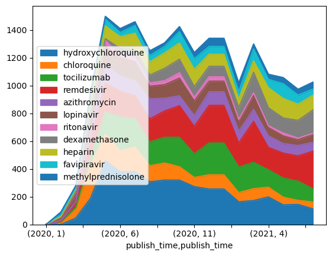

In diesem Workshop arbeiten wir mit Python und erstellen eine erste umfangreiche Datenanalyse. Ihnen stehen dafür unterschiedliche Datensätze zur Verfügung.
{: .notice--primary}  

Hinweis (1): Für die Präsentation Ihrer Ergebnisse ist kein Format vorgegeben - versuchen Sie, möglichst realistisch-professionell vorzugehen und eine interessante, sowie optisch und inhaltlich ansprechende Präsentation zu erstellen!
{: .notice--info}

Hinweis (2): Ebenfalls ist nicht vorgegeben, wie Sie sich als Team organisieren. Besonders empfohlen wird der Modus des "Group Programming", bei dem alle an einem Bildschirm gemeinsam arbeiten und sich gegenseitg Code-Schnippsel diktieren. Die genaue Aufgabenteilung steht Ihnen jedoch frei.
{: .notice--info}

## 🚀 Challenge #1: Formulardaten

Einer Ihrer Kunden nutzt ein [einfaches Formular](client_form.html) um grundlegende Informationen über die Kundenbasis zu sammeln.Die gesammelten Daten liegen uns nun vor. Werfen Sie einen Blick auf das Formular. Den zugehörigen [Datensatz im CSV-Format](../../data/form.csv) können Sie ebenfalls herunterladen. Ihr Kunde ist noch unsicher, was er mit den Daten anfangen soll. Erkunden Sie die Daten deshalb mit mit dem [Client Form Notebook](client_form.ipynb). Welche Empfehlungen können Sie machen? 

**Aufgabe:** Wenden Sie Ihr gelerntes Wissen an und erstellen Sie einen kurzen Bericht über die Daten und Ihre Erkenntnisse!
{: .notice--warning} 

## 🚀 Challenge #2: Diabetes-Studie

In dieser Challenge untersuchen wir einen kleinen öffentlichen [Diabetes Datensatz](https://www4.stat.ncsu.edu/~boos/var.select/diabetes.html).

|   | AGE | SEX | BMI | BP | S1 | S2 | S3 | S4 | S5 | S6 | Y  |
|---|-----|-----|-----|----|----|----|----|----|----|----|----|
| 0 | 59 | 2 | 32.1 | 101. | 157 | 93.2 | 38.0 | 4. | 4.8598 | 87 | 151 |
| 1 | 48 | 1 | 21.6 | 87.0 | 183 | 103.2 | 70. | 3. | 3.8918 | 69 | 75 |
| 2 | 72 | 2 | 30.5 | 93.0 | 156 | 93.6 | 41.0 | 4.0 | 4. | 85 | 141 |
| ... | ... | ... | ... | ...| ...| ...| ...| ...| ...| ...| ... |

Öffnen Sie das zugehörige [Diabetes notebook](diabetes.ipynb) 

**Aufgabe:** Wenden Sie Ihr gelerntes Wissen an und erstellen Sie einen kurzen Bericht über die Daten und Ihre Erkenntnisse!
{: .notice--warning} 

Führen Sie dafür unter anderem folgende Analysen aus:

   * [ ] Berechnen Sie Mittelwert und Varianz für alle Spalten.
   * [ ] Erstellen Sie Boxplots für BMI, BP und Y, getrennt nach gender.
   * [ ] Wie sieht die Verteilung für Age, Sex, BMI und Y aus?
   * [ ] Testen SIe die Korrelation zwischen verschiedenen Variablen und der Disease Progression (Y).
   * [ ] Prüfen Sie die Hypothese, dass die Diabetes Progression sich zwischen Männern und Frauen unterscheidet.

## 🚀 Challenge #3 Ausbreitung von COVID-19

Wir wollen die Ausbreitung von COVID-19 anhand eines Datensatzes studieren. Dazu verwenden wir Zahlen über die Häufigkeiten von Infektion in verschiedenen Ländern, zur Verfügung gestellt vom [Center for Systems Science and Engineering](https://systems.jhu.edu/) (CSSE) der [Johns Hopkins University](https://jhu.edu/). Der Datensatz findet sich in [diesem GitHub Repository](https://github.com/CSSEGISandData/COVID-19).

**Aufgabe:** Öffnen und studieren Sie [`notebook-covidspread.ipynb`](notebook-covidspread.ipynb). Führen Sie alle Zellen aus und beantworten Sie die kleineren Fragen am Ende des Notebooks. Wenden Sie Ihr gelerntes Wissen an und erstellen Sie einen kurzen Bericht über die Daten und Ihre Erkenntnisse!
{: .notice--warning} 

**Bonus:** Wenn Sie gute Fortschritte mit der Challenge gemacht haben, können Sie sich an einige fortgeschrittene Aufgaben wagen.
{: .notice--warning} 

Versuchen Sie sich an folgenden Aufgaben:

 - [ ] Plotten Sie *Rt* Plots zum Vergleich von 5-6 verschiedenen Ländern
 - [ ] Untersuchen Sie, wie die Anzahl der Todesfälle (number of deaths) mit der Infektionsrate (number of infected cases) korreliert.
 - [ ] Finden Sie heraus, wie lange ein typischer Krankheitsverlauf dauert. Beobachten Sie ggf. auch Unterschiede zwischen verschiedenen Ländern.
 - [ ] Berechnen Sie die Sterberate (fatality rate) und untersuchen Sie, ob/wie sich der Wert mit der Zeit verändert.

## 🚀 Challenge #4: COVID Publikationen

In dieser Challenge setzen wir das Studium von COVID 19 fort und fokussieren auf wissenschaftliche Publikationen.. Das [CORD-19 Dataset](https://www.kaggle.com/allen-institute-for-ai/CORD-19-research-challenge) enthält tausende Papers zu COVID, zusammen mit Abstracts und Metadaten, sowie Volltext für einen großen Teil der Dokumente.

Eine detaillierte Darstellung von des [Text Analytics for Health](https://docs.microsoft.com/azure/cognitive-services/text-analytics/how-tos/text-analytics-for-health/?WT.mc_id=academic-77958-bethanycheum) Cognitive Service findet sich [in diesem Blog Post](https://soshnikov.com/science/analyzing-medical-papers-with-azure-and-text-analytics-for-health/). Wir werden eine vereinfachte Form der Analyse vornehmen.

> **Hinweis**: Aus Lizenzgründen veröffentlichen wir hier nicht die Originaldaten. Sie können die [`metadata.csv`](https://www.kaggle.com/allen-institute-for-ai/CORD-19-research-challenge?select=metadata.csv) Datei aus [diesem Datensatz auf Kaggle](https://www.kaggle.com/allen-institute-for-ai/CORD-19-research-challenge) herunterladen. Eventuell müssen Sie sich dafür bei Kaggle regsitrieren. Ohne Registrierung erhalten Sie die Daten auch [hier](https://ai2-semanticscholar-cord-19.s3-us-west-2.amazonaws.com/historical_releases.html), dann sogar mit mehr Volltexten.

**Aufgabe:** Studieren und bearbeiten Sie [`notebook-papers.ipynb`](notebook-papers.ipynb). Führen Sie alle Zellen aus und beantworten Sie die kleineren Fragen am Ende des Notebooks. Wenden Sie Ihr gelerntes Wissen an und erstellen Sie einen kurzen Bericht über die Daten und Ihre Erkenntnisse!
{: .notice--warning} 

**Bonus:** Wenn Sie gute Fortschritte mit der Challenge gemacht haben, können Sie sich an einige fortgeschrittene Aufgaben wagen.
{: .notice--warning} 

Versuchen Sie sich an folgenden Aufgaben:

- [ ] Erstellen Sie eine Co-occurrence Matrix zwischen Medikationen, und berichten Sie, welche Kombinationen häufig zusammen auftreten. Verwenden Sie dafür den Code, der Medikationen und Diagnosen gegenüberstellt.
- [ ] Visualisieren Sie das Ganze mit einer Heat Map.

## 🚀🚀 Super Challenge für COVID Publikationen

- [ ] Visualisieren Sie das Ganze mit einem [Chord Diagram](https://en.wikipedia.org/wiki/Chord_diagram). [Diese Library](https://pypi.org/project/chord/) hilft Ihnen vielleicht dabei.
- [ ] Untersuchen Sie, welche Dosieren von Medikamenten (z.B. *take 400mg of chloroquine daily*) häufig vorkommen, indem Sie reguläre Ausdrücke verwenden. Stellen Sie häufige Dosierungen in einem Data Frame darf. Tipp: vielleicht gelingt es, wenn Sie nach numerischen Werten suchen, die in der Nähe von Medikamenten-Namen vorkommen.

## 🚀 Impuls: Datensatz-Steckbrief

Mittlerweile sollten Sie eine favorisierte Fragestellung einen zugehörigen Datensatz für Ihr Gesellenstück ins Auge gefasst haben. Falls Sie noch keinen Favoriten haben, nutzen Sie eines der heutigen Beispiele oder greifen Sie auf die Datensatz-Schatzkiste zurück.

Studieren Sie [dieses Template für einen Datensatz-Steckbrief](data-sheet.md). Füllen Sie ein Dokument nach diesem Template für *Ihren* Datensatz soweit wie möglich aus. Zu späteren Zeitpunkten werden wir das Dokument ergänzen.
{: .notice--warning} 

**Empfehlung:** Erstellen Sie sich ein Git-Repository für Ihre Arbeit im Semester. Legen Sie sich dort ein Markdown-Dokument für einen Datensatz-Steckbrief an, welches dem hier gezeigten Templat folgt. Markieren Sie sich in Ihrem Kalender drei weitere Meilenstein-Termine im Semester, an dem Sie den Datensatz-Steckbrief aktualisieren möchten. 
{: .notice--info} 

**Bonus** Entwerfen Sie ein ansprechendes Canvas-Format für das Template und Ihren persönlichen Datensatz-Steckbrief. [Hier](https://www.datentreiber.de/methode/#canvas) finden Sie aller Beispiele, wie Business-Menschen einen Canvas designen.
{: .notice--warning} 