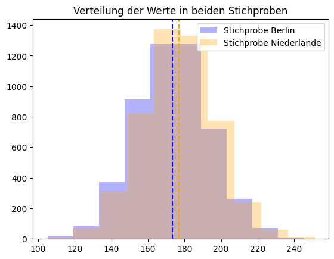
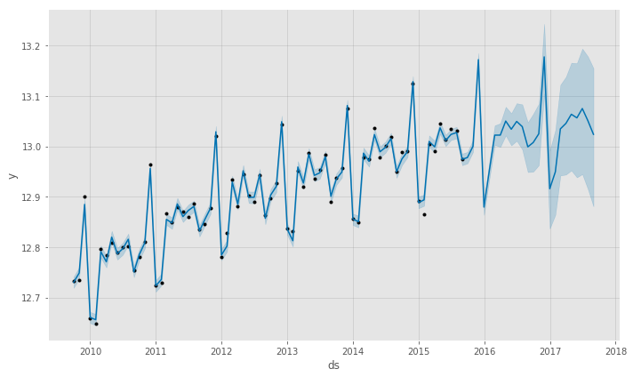

### 🚀 Input: Gesetz der großen Zahlen, Hypothesentests



Eine grundlegende Intution zu statistischen Tests ist wichtig, deshalb wollen wir das Thema vor Ort "sichern" und vertiefen. Lassen Sie uns gemeinsam das [Detail-Notebook](./detail.ipynb) betrachten.


### 🚀 Challenge #1: Diabetes-Studie

Heute arbeiten wir mit einem kleinen Diabetes-Datensatz, den Sie [hier](https://www4.stat.ncsu.edu/~boos/var.select/diabetes.html) herunterladen können.

|   | AGE | SEX | BMI | BP | S1 | S2 | S3 | S4 | S5 | S6 | Y  |
|---|-----|-----|-----|----|----|----|----|----|----|----|----|
| 0 | 59 | 2 | 32.1 | 101. | 157 | 93.2 | 38.0 | 4. | 4.8598 | 87 | 151 |
| 1 | 48 | 1 | 21.6 | 87.0 | 183 | 103.2 | 70. | 3. | 3.8918 | 69 | 75 |
| 2 | 72 | 2 | 30.5 | 93.0 | 156 | 93.6 | 41.0 | 4.0 | 4. | 85 | 141 |
| ... | ... | ... | ... | ...| ...| ...| ...| ...| ...| ...| ... |

Öffnen Sie das [assignment notebook](./assignment.ipynb) und lernen Sie mehr über die Patienten. 
{: .notice--warning} 
 
* Bearbeiten Sie dafür unter anderem folgende Fragen:
   * [ ] Was bedeuten die Variablen, wie liegen Mittelwert und Standardabweichung und wie interpretieren Sie das?
   * [ ] Wie sind Alter, Geschlecht, BMI und Krankheitsbild (Y) verteilt? Wie interpretieren Sie das?
   * [ ] Welche Parameter erklären das Krankheitsbild am ehesten? Nutzen Sie die Korrelation, um die Frage zu beantworten!
   * [ ] Prüfen Sie im Anschluss auch die Hypothese, dass sich das Krankheitsbild (Y) zwischen den Geschlechtern unterscheidet.


### 🚀 Challenge #2: Multiple Testing

Lassen Sie uns nun auch die Relevanz der anderen Variablen genauer untersuchen. Wir denken uns dafür ein sehr einfaches Schema aus: Wandeln Sie Alter, BMI, BP und S1, S2, ... in binäre Variablen um: ist der Wert niedriger als der Mittelwert, ist der Patient für diesen Test in  _Gruppe 1_. Ist der Wert höher, ist der Patient in _Gruppe 2_, zum Beispiel so:

```python
group1 = df[df['BMI'] <= 25]['Y']
group2 = df[df['BMI'] > 25]['Y']
```

**Aufgabe:**: Prüfen Sie für jede Variable die Hypothese, of es einen signifikanten Unterschied zwischen Gruppe 1 und 2 bezüglich dieser Variable gibt!
{: .notice--warning} 

### 🚀 Challenge #3: Praktische Hypothesen-Tests

**Aufgabe:** Überlegen Sie sich eine Frage aus Ihrem Data Science Projekt, dass Sie als Hypothesentest formulieren können.
{: .notice--warning} 


### 🚀 Challenge #4: Prophet für Forecasting



`Prophet` ist ein etablierters Tool von Meta/Facebook für die Arbeit mit Zeitreihen. Folgen Sie dem übersichtlichen [Beispiel in diesem Tutorial](https://github.com/urgedata/pythondata/blob/master/fbprophet/fbprophet_part_one.ipynb) und verfolgen Sie, wie der Autor `Prophet` verwendet, um die Umsatzzahlen eines Unternehmens vorherzusagen. 

**Aufgabe (Level 1):** Machen Sie sich zunächst mit dem Beispiel vertraut. Kopieren Sie den Code in Ihre Arbeitsumgebung.
{: .notice--warning} 

**Aufgabe (Level 2):** Das Modell scheint recht gut zu funktionieren. Der Autor macht aber wenig Bemühungen, den Fehler des Modells zu quantifizieren. Überlegen Sie: wie könnten Sie einen objektiven Messwert für die Güte des Modells erhalten?
{: .notice--warning} 

**Aufgabe (Level 2):** Prophet zerlegt die Zeitreihe in so einige Komponenten, die oberflächlich auch im Beispiel kurz sichtbar werden. Schauen Sie sich auf der Website um, fragen Sie ChatGPT oder lesen Sie die Doku und modifizieren Sie den Code, so dass die einzelnen Komponenten sichtbar werden. Was können Sie aus den Komponenten ablesen?
{: .notice--warning} 

**Aufgabe (Level 3, für Zeitreihen-Enthusiasten):** Das geht besser, oder? Schauen Sie sich auf der Website um, fragen Sie Google und ChatGPT oder lesen Sie die Doku und modifizieren Sie den Code, um das Modell zu verbessern, z.B. indem Sie Feiertage in die Analyse mit aufnehmen oder die Information über Wochentage inkludieren. Vielleicht gibt es ja auch noch andere Paramter - wie sehr können Sie den Forecast in Ihrer anfangs genutzten Metrik verbessern?
{: .notice--warning} 